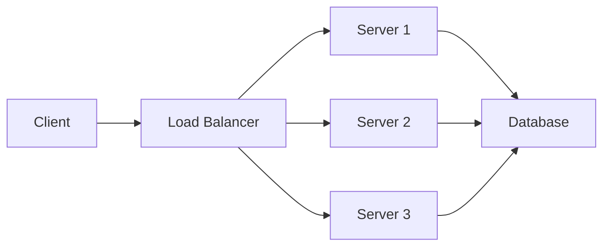

# Quick Start Guide

## Initial Setup (One-time)

1. **Install Python dependencies**:
```bash
python3 -m venv venv
source venv/bin/activate
pip install -r requirements.txt
```

2. **Update your GitHub username**:
   - Edit `mkdocs.yml` and replace `yourusername` with your GitHub username
   - Edit `README.md` and do the same

## Daily Workflow

### Preview Site Locally

```bash
./scripts/serve.sh
# Or manually:
source venv/bin/activate
mkdocs serve
```

Visit http://127.0.0.1:8000 in your browser.

### Add a New Daily Log

1. Create a new file: `docs/daily/YYYY-MM-DD.md`
2. Use this template:

```markdown
# Day X - [Full Date]

## Topics Covered
- Topic 1
- Topic 2

## Key Learnings
- Learning 1
- Learning 2

## System Design Concepts
### Concept Name
Description and notes

## Questions to Explore
- [ ] Question 1
- [ ] Question 2

## Resources
- [Link](url)

## Practice Problems
Problem and solution approach

## Reflections
What went well, what to improve

## Next Steps
- [ ] Task 1
- [ ] Task 2

---

[← Back to Daily Logs](index.md) | [Home](../index.md)
```

3. Update `mkdocs.yml` navigation to include your new entry:

```yaml
nav:
  - Home: index.md
  - Daily Logs:
    - Overview: daily/index.md
    - Day 1 (Oct 24): daily/2024-10-24.md
    - Day 2 (Oct 25): daily/2024-10-25.md  # Add new entries here
```

### Add Topic Pages

1. Create files in `docs/topics/` (e.g., `docs/topics/caching.md`)
2. Update navigation in `mkdocs.yml`

## Publishing to GitHub

### First Time Setup

1. **Create GitHub repository**:
```bash
# On GitHub, create a new repository named "system-design-journey"
```

2. **Connect local repo to GitHub**:
```bash
git remote add origin https://github.com/YOUR_USERNAME/system-design-journey.git
```

3. **Enable GitHub Pages**:
   - Go to repository Settings → Pages
   - Source: GitHub Actions

### Deploy Updates

**Option 1: Automatic (via GitHub Actions)**
```bash
git add .
git commit -m "Add daily log for [date]"
git push origin main
```

The site will automatically build and deploy via GitHub Actions.

**Option 2: Manual**
```bash
./scripts/deploy.sh
# Or manually:
source venv/bin/activate
mkdocs gh-deploy
```

## Useful Commands

```bash
# Build the site locally
mkdocs build

# Serve locally with live reload
mkdocs serve

# Deploy to GitHub Pages
mkdocs gh-deploy

# Check for broken links
mkdocs build --strict
```

## Tips

1. **Daily Consistency**: Set a reminder to log your learning daily
2. **Use Diagrams**: MkDocs Material supports Mermaid diagrams
3. **Tag Your Content**: Use frontmatter to add tags for better organization
4. **Cross-Reference**: Link between daily logs and topic pages
5. **Update Resources**: Keep the resources page current as you discover new materials

## Diagram Example (Mermaid)



## Next Steps

1. Push your initial setup to GitHub
2. Enable GitHub Pages in repository settings
3. Start your first real daily log entry
4. Share your learning journey!
