# Day 1 - October 24, 2024

## Topics Covered
- Setting up learning environment
- GitHub Pages and MkDocs setup
- Fundamental building blocks of distributed systems
- System design interview approach
- Scalability patterns from 1K to 10M+ users

## Key Learnings
- Organized approach to system design learning is crucial
- Documentation helps solidify understanding
- Daily logging creates accountability and tracks progress
- Visual diagrams are essential for understanding system architecture
- Start simple, then scale incrementally

---

## 1. Fundamental Building Blocks of Distributed Systems

### System Architecture Overview

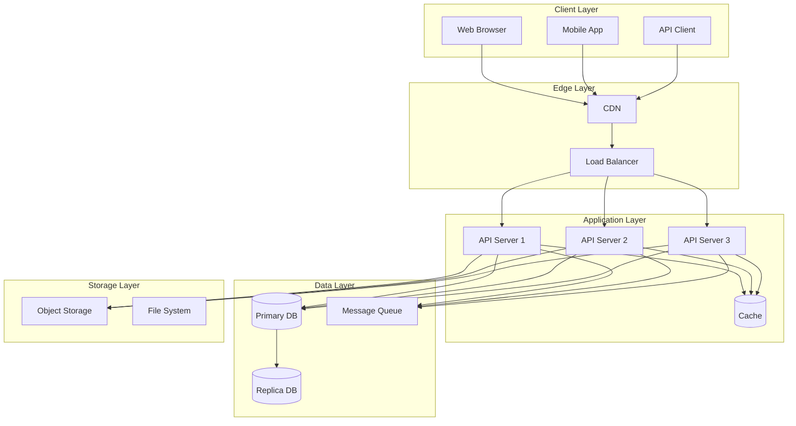
```mermaid
graph TB
    subgraph "Client Layer"
        C1[Web Browser]
        C2[Mobile App]
        C3[API Client]
    end

    subgraph "Edge Layer"
        CDN[CDN]
        LB[Load Balancer]
    end

    subgraph "Application Layer"
        API1[API Server 1]
        API2[API Server 2]
        API3[API Server 3]
        Cache[(Cache)]
    end

    subgraph "Data Layer"
        DB1[(Primary DB)]
        DB2[(Replica DB)]
        MQ[Message Queue]
    end

    subgraph "Storage Layer"
        S3[Object Storage]
        FS[File System]
    end

    C1 & C2 & C3 --> CDN
    CDN --> LB
    LB --> API1 & API2 & API3
    API1 & API2 & API3 --> Cache
    API1 & API2 & API3 --> DB1
    DB1 --> DB2
    API1 & API2 & API3 --> MQ
    API1 & API2 & API3 --> S3
```

### Load Balancers

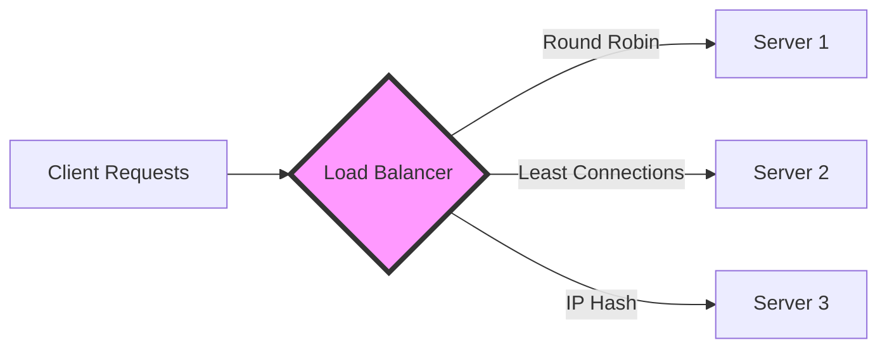
```mermaid
graph LR
    Client[Client Requests] --> LB{Load Balancer}
    LB -->|Round Robin| S1[Server 1]
    LB -->|Least Connections| S2[Server 2]
    LB -->|IP Hash| S3[Server 3]

    style LB fill:#f9f,stroke:#333,stroke-width:4px
```

**Key Algorithms:**
- **Round Robin**: Distribute requests sequentially to each server in rotation
- **Least Connections**: Route to the server with the fewest active connections
- **IP Hash**: Consistently route the same client IP to the same server

### Caching Layers

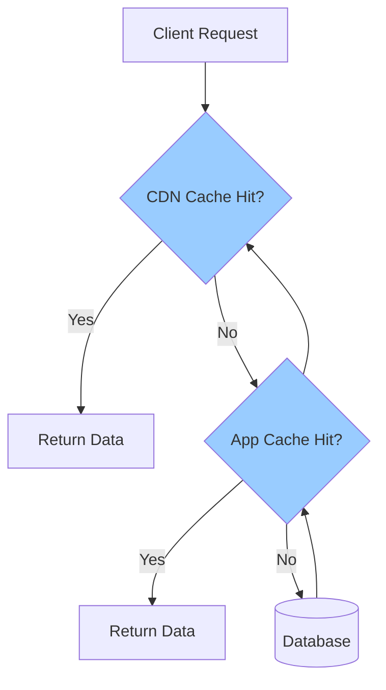
```mermaid
graph TD
    Request[Client Request] --> CDN{CDN Cache Hit?}
    CDN -->|Yes| Return1[Return Data]
    CDN -->|No| AppCache{App Cache Hit?}
    AppCache -->|Yes| Return2[Return Data]
    AppCache -->|No| DB[(Database)]
    DB --> AppCache
    AppCache --> CDN

    style CDN fill:#9cf
    style AppCache fill:#9cf
```

### Database Replication

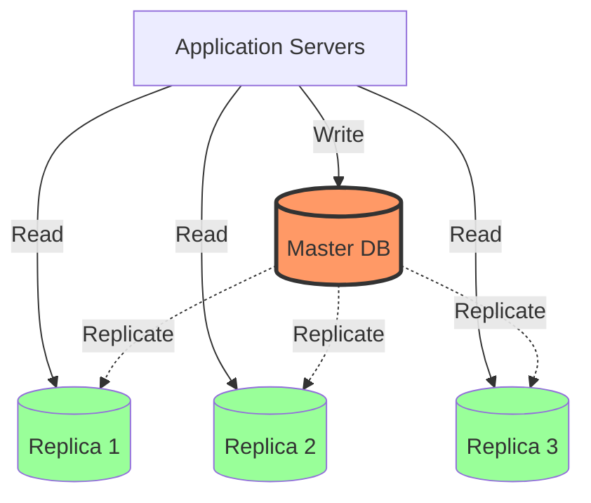
```mermaid
graph TB
    App[Application Servers]
    App -->|Write| Master[(Master DB)]
    App -->|Read| R1[(Replica 1)]
    App -->|Read| R2[(Replica 2)]
    App -->|Read| R3[(Replica 3)]

    Master -.->|Replicate| R1
    Master -.->|Replicate| R2
    Master -.->|Replicate| R3

    style Master fill:#f96,stroke:#333,stroke-width:3px
    style R1 fill:#9f9
    style R2 fill:#9f9
    style R3 fill:#9f9
```

### Database Sharding

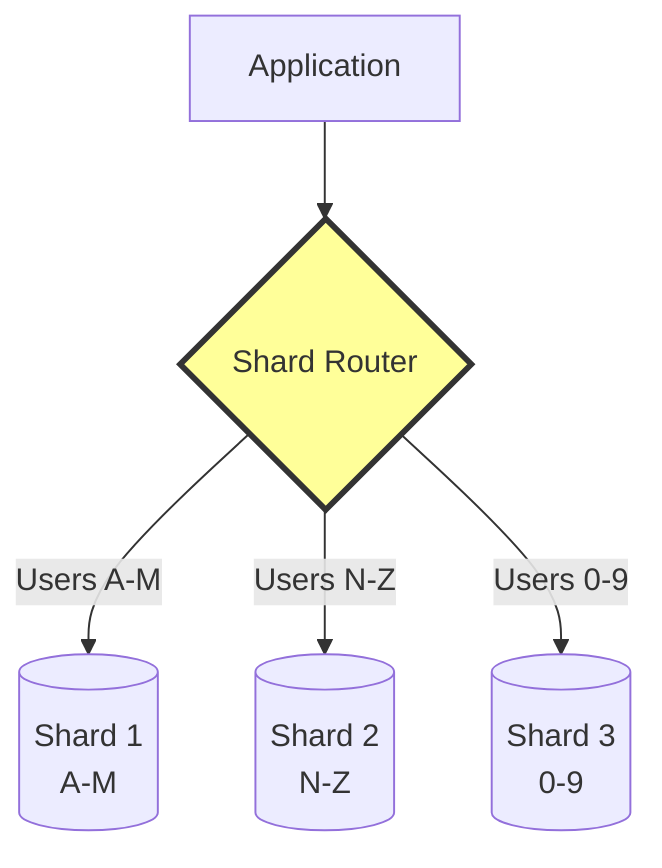
```mermaid
graph TB
    App[Application] --> Router{Shard Router}

    Router -->|Users A-M| S1[(Shard 1<br/>A-M)]
    Router -->|Users N-Z| S2[(Shard 2<br/>N-Z)]
    Router -->|Users 0-9| S3[(Shard 3<br/>0-9)]

    style Router fill:#ff9,stroke:#333,stroke-width:3px
```

**Sharding Strategies:** Range-based, Hash-based, Geographic

### Message Queues

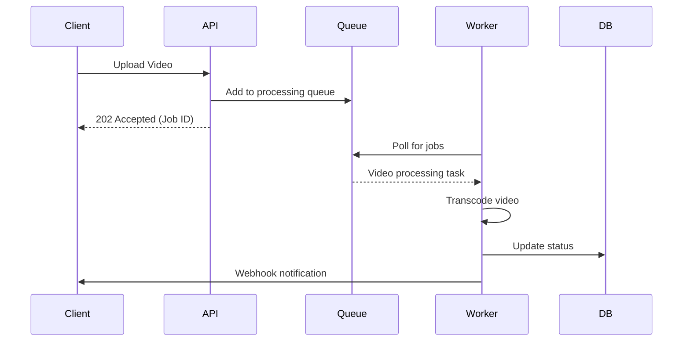
```mermaid
sequenceDiagram
    participant Client
    participant API
    participant Queue
    participant Worker
    participant DB

    Client->>API: Upload Video
    API->>Queue: Add to processing queue
    API-->>Client: 202 Accepted (Job ID)

    Worker->>Queue: Poll for jobs
    Queue-->>Worker: Video processing task
    Worker->>Worker: Transcode video
    Worker->>DB: Update status
    Worker->>Client: Webhook notification
```

### Microservices Architecture

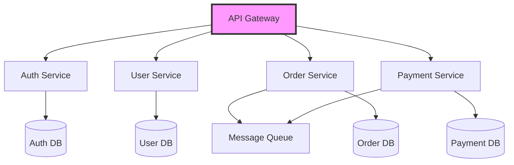
```mermaid
graph TB
    Gateway[API Gateway]

    Gateway --> Auth[Auth Service]
    Gateway --> User[User Service]
    Gateway --> Order[Order Service]
    Gateway --> Payment[Payment Service]

    Order --> MQ[Message Queue]
    Payment --> MQ

    Auth --> AuthDB[(Auth DB)]
    User --> UserDB[(User DB)]
    Order --> OrderDB[(Order DB)]
    Payment --> PayDB[(Payment DB)]

    style Gateway fill:#f9f,stroke:#333,stroke-width:3px
```

### CDN Architecture

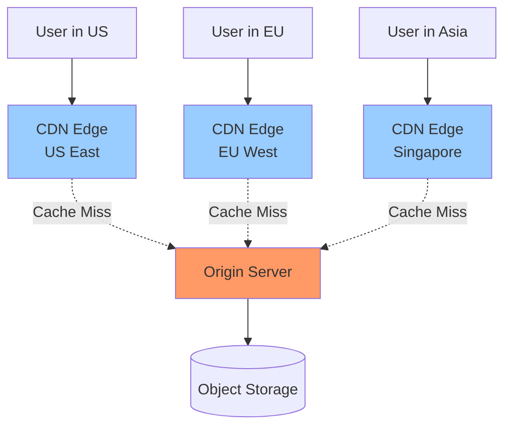
```mermaid
graph TB
    User1[User in US] --> CDN_US[CDN Edge<br/>US East]
    User2[User in EU] --> CDN_EU[CDN Edge<br/>EU West]
    User3[User in Asia] --> CDN_ASIA[CDN Edge<br/>Singapore]

    CDN_US -.->|Cache Miss| Origin[Origin Server]
    CDN_EU -.->|Cache Miss| Origin
    CDN_ASIA -.->|Cache Miss| Origin

    Origin --> S3[(Object Storage)]

    style Origin fill:#f96
    style CDN_US fill:#9cf
    style CDN_EU fill:#9cf
    style CDN_ASIA fill:#9cf
```

---

## 2. System Design Interview Approach

### Interview Flow

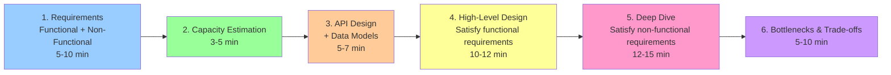
```mermaid
graph LR
    A[1. Requirements<br/>Functional + Non-Functional<br/>5-10 min] --> B[2. Capacity Estimation<br/>3-5 min]
    B --> C[3. API Design<br/>+ Data Models<br/>5-7 min]
    C --> D[4. High-Level Design<br/>Satisfy functional requirements<br/>10-12 min]
    D --> E[5. Deep Dive<br/>Satisfy non-functional requirements<br/>12-15 min]
    E --> F[6. Bottlenecks & Trade-offs<br/>5-10 min]

    style A fill:#9cf
    style B fill:#9f9
    style C fill:#fc9
    style D fill:#ff9
    style E fill:#f9c
    style F fill:#c9f
```

### Step 1: Functional Requirements

**What the system DOES - Core features and user actions**

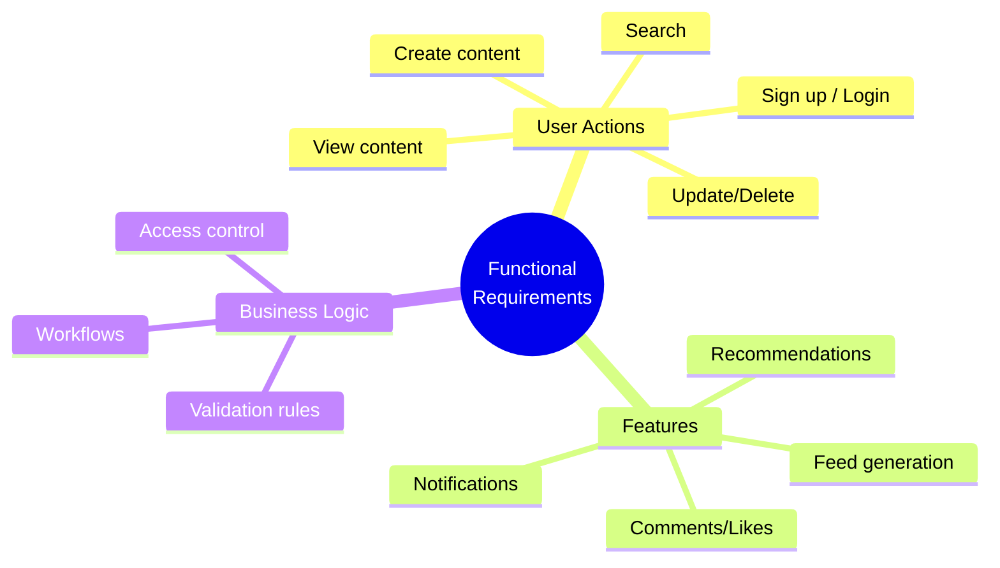
```mermaid
mindmap
  root((Functional<br/>Requirements))
    User Actions
      Sign up / Login
      Create content
      View content
      Update/Delete
      Search
    Features
      Feed generation
      Notifications
      Recommendations
      Comments/Likes
    Business Logic
      Validation rules
      Access control
      Workflows
```

**Example Questions:**
- What are the core features?
- What can users do?
- What happens when user performs action X?
- Are there different user types/roles?

### Step 2: Non-Functional Requirements

**HOW WELL the system performs - Quality attributes**

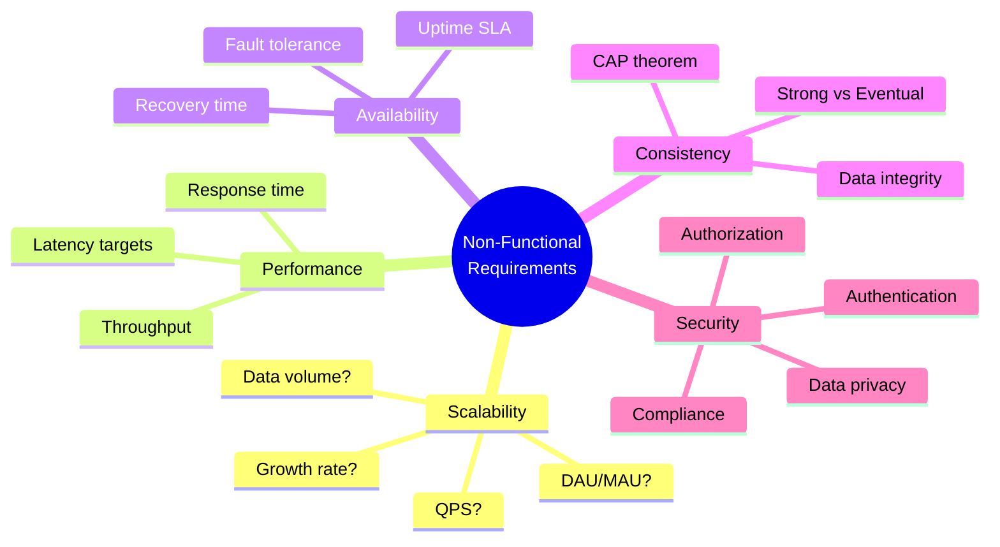
```mermaid
mindmap
  root((Non-Functional<br/>Requirements))
    Scalability
      DAU/MAU?
      QPS?
      Data volume?
      Growth rate?
    Performance
      Latency targets
      Throughput
      Response time
    Availability
      Uptime SLA
      Fault tolerance
      Recovery time
    Consistency
      Strong vs Eventual
      CAP theorem
      Data integrity
    Security
      Authentication
      Authorization
      Data privacy
      Compliance
```

**Example Questions:**
- How many users? (100M DAU)
- Read vs Write ratio? (100:1)
- What's acceptable latency? (< 200ms)
- Strong or eventual consistency?
- Geographic distribution?

### Step 3: Capacity Estimation

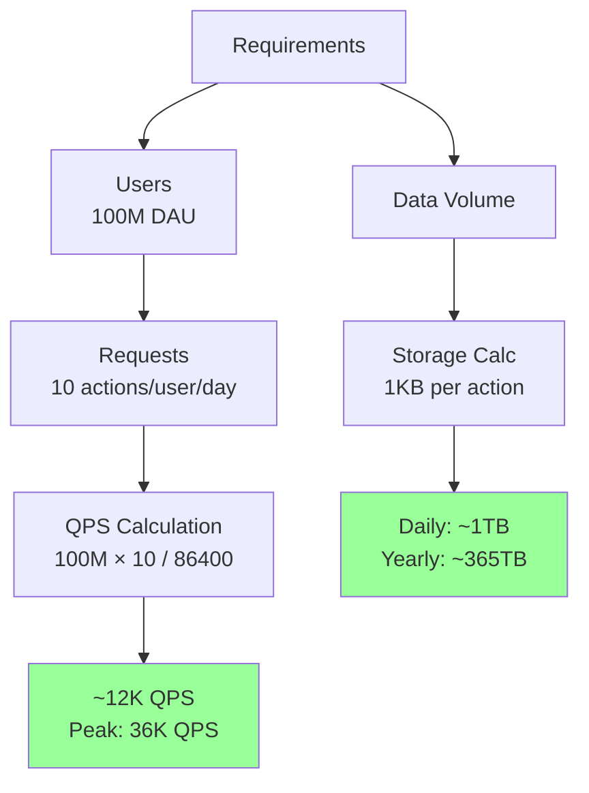
```mermaid
graph TB
    Start[Requirements] --> Users[Users<br/>100M DAU]
    Users --> Requests[Requests<br/>10 actions/user/day]
    Requests --> QPS[QPS Calculation<br/>100M × 10 / 86400]
    QPS --> Result[~12K QPS<br/>Peak: 36K QPS]

    Start --> Data[Data Volume]
    Data --> Storage[Storage Calc<br/>1KB per action]
    Storage --> Total[Daily: ~1TB<br/>Yearly: ~365TB]

    style Result fill:#9f9
    style Total fill:#9f9
```

**Formulas:**
- QPS = (DAU × actions_per_user) / 86,400
- Peak QPS = Average QPS × 3
- Storage = QPS × data_size × seconds_per_day

### Step 4: API Design

**Define key endpoints early (subject to refinement in deep dive)**

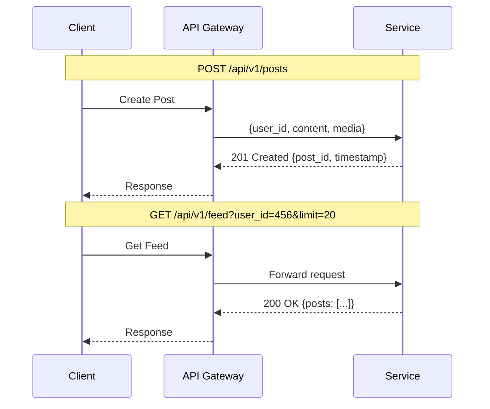
```mermaid
sequenceDiagram
    participant Client
    participant API Gateway
    participant Service

    Note over Client,Service: POST /api/v1/posts
    Client->>API Gateway: Create Post
    API Gateway->>Service: {user_id, content, media}
    Service-->>API Gateway: 201 Created {post_id, timestamp}
    API Gateway-->>Client: Response

    Note over Client,Service: GET /api/v1/feed?user_id=456&limit=20
    Client->>API Gateway: Get Feed
    API Gateway->>Service: Forward request
    Service-->>API Gateway: 200 OK {posts: [...]}
    API Gateway-->>Client: Response
```

**Core APIs:**
- `POST /users` - Create user
- `POST /posts` - Create content
- `GET /feed` - Retrieve personalized feed
- `GET /posts/:id` - Get specific post
- `POST /posts/:id/like` - Like content
- `DELETE /posts/:id` - Remove content

### Step 5: Initial Data Models

**High-level schema (will be refined during deep dive)**

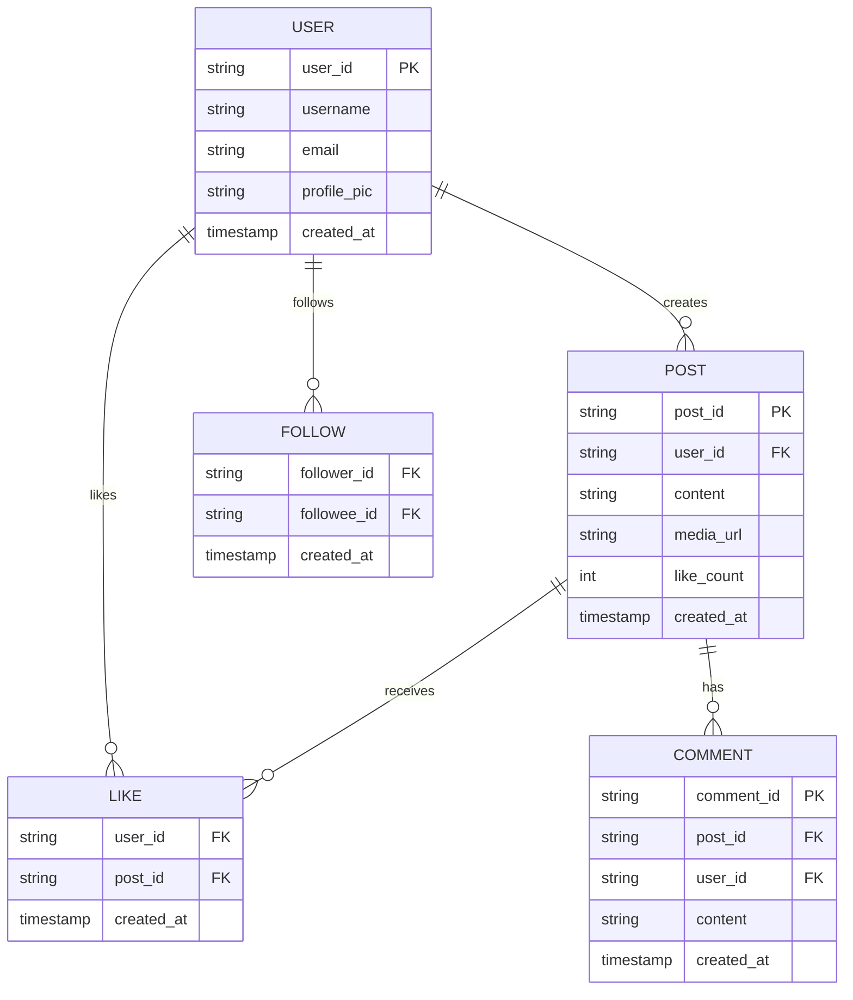
```mermaid
erDiagram
    USER ||--o{ POST : creates
    USER ||--o{ FOLLOW : follows
    USER ||--o{ LIKE : likes
    POST ||--o{ LIKE : receives
    POST ||--o{ COMMENT : has

    USER {
        string user_id PK
        string username
        string email
        string profile_pic
        timestamp created_at
    }

    POST {
        string post_id PK
        string user_id FK
        string content
        string media_url
        int like_count
        timestamp created_at
    }

    FOLLOW {
        string follower_id FK
        string followee_id FK
        timestamp created_at
    }

    LIKE {
        string user_id FK
        string post_id FK
        timestamp created_at
    }

    COMMENT {
        string comment_id PK
        string post_id FK
        string user_id FK
        string content
        timestamp created_at
    }
```

**Note:** Data models will evolve during deep dive based on:
- Query patterns
- Sharding strategy
- Denormalization needs
- Caching requirements

### Step 6: High-Level Design

**Goal: Satisfy functional requirements - focus on making features work**

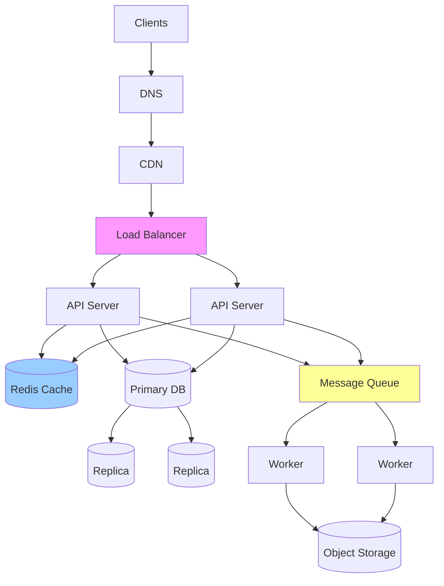
```mermaid
graph TB
    Client[Clients] --> DNS[DNS]
    DNS --> CDN[CDN]
    CDN --> LB[Load Balancer]

    LB --> API1[API Server]
    LB --> API2[API Server]

    API1 & API2 --> Cache[(Redis Cache)]
    API1 & API2 --> DB[(Primary DB)]

    DB --> Replica1[(Replica)]
    DB --> Replica2[(Replica)]

    API1 & API2 --> Queue[Message Queue]
    Queue --> Worker1[Worker]
    Queue --> Worker2[Worker]

    Worker1 & Worker2 --> Storage[(Object Storage)]

    style LB fill:#f9f
    style Cache fill:#9cf
    style Queue fill:#ff9
```

**At this stage:**
- Start simple - single region, basic components
- Show data flow for key features
- Map APIs to components
- Demonstrate how functional requirements are met
- Don't over-engineer yet!

**Example walkthrough:**
1. User creates post → API Server → Save to DB
2. User views feed → API Server → Check Cache → Query DB if miss
3. Image upload → API Server → Queue → Worker → Object Storage

### Step 7: Deep Dive

**Goal: Satisfy non-functional requirements - scale, performance, reliability**

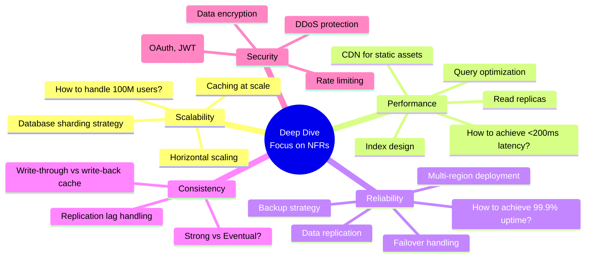
```mermaid
mindmap
  root((Deep Dive<br/>Focus on NFRs))
    Scalability
      How to handle 100M users?
      Database sharding strategy
      Caching at scale
      Horizontal scaling
    Performance
      How to achieve <200ms latency?
      Query optimization
      Index design
      CDN for static assets
      Read replicas
    Reliability
      How to achieve 99.9% uptime?
      Failover handling
      Data replication
      Multi-region deployment
      Backup strategy
    Consistency
      Strong vs Eventual?
      Write-through vs write-back cache
      Replication lag handling
    Security
      Authentication (OAuth, JWT)
      Rate limiting
      Data encryption
      DDoS protection
```

**Typical Deep Dive Topics:**
- **For 100M users**: Add sharding, multiple cache clusters, auto-scaling
- **For <200ms latency**: Add edge locations, optimize queries, increase replicas
- **For high availability**: Multi-AZ deployment, circuit breakers, health checks
- **For consistency**: Choose replication strategy, handle conflicts

**Data Model Refinements:**
- Denormalize for read performance
- Add composite indexes
- Partition large tables
- Add caching layer schemas

### Step 8: Bottleneck Analysis & Trade-offs

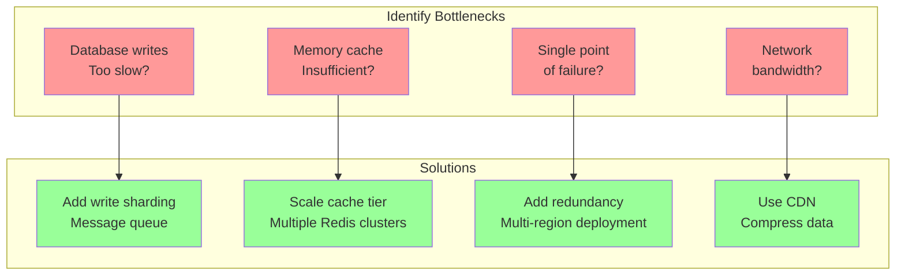
```mermaid
graph TB
    subgraph "Identify Bottlenecks"
        B1[Database writes<br/>Too slow?]
        B2[Memory cache<br/>Insufficient?]
        B3[Single point<br/>of failure?]
        B4[Network<br/>bandwidth?]
    end

    subgraph "Solutions"
        S1[Add write sharding<br/>Message queue]
        S2[Scale cache tier<br/>Multiple Redis clusters]
        S3[Add redundancy<br/>Multi-region deployment]
        S4[Use CDN<br/>Compress data]
    end

    B1 --> S1
    B2 --> S2
    B3 --> S3
    B4 --> S4

    style B1 fill:#f99
    style B2 fill:#f99
    style B3 fill:#f99
    style B4 fill:#f99
    style S1 fill:#9f9
    style S2 fill:#9f9
    style S3 fill:#9f9
    style S4 fill:#9f9
```

### Trade-offs Discussion

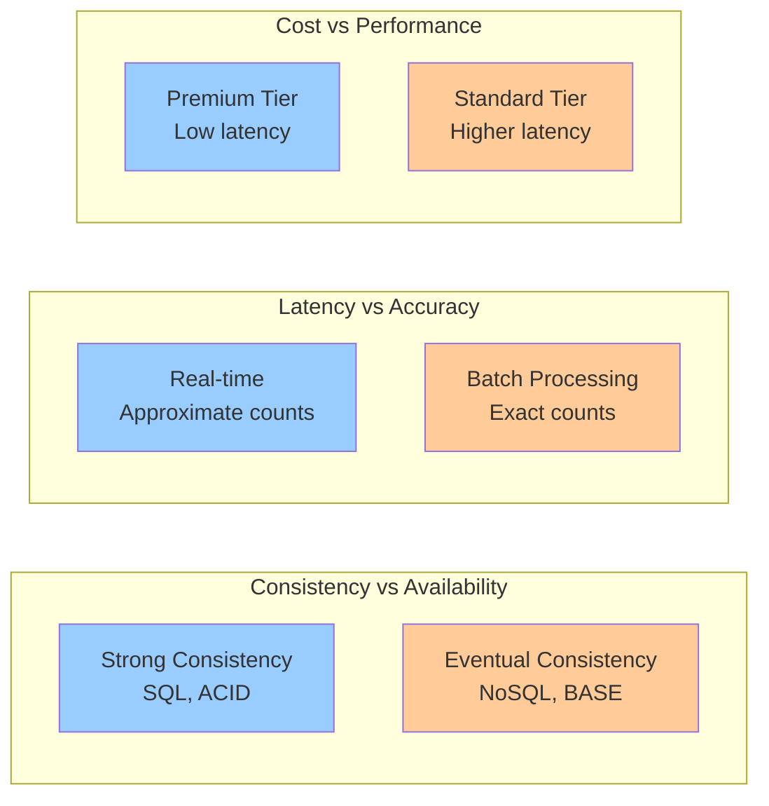
```mermaid
graph LR
    subgraph "Consistency vs Availability"
        C1[Strong Consistency<br/>SQL, ACID]
        C2[Eventual Consistency<br/>NoSQL, BASE]
    end

    subgraph "Latency vs Accuracy"
        L1[Real-time<br/>Approximate counts]
        L2[Batch Processing<br/>Exact counts]
    end

    subgraph "Cost vs Performance"
        P1[Premium Tier<br/>Low latency]
        P2[Standard Tier<br/>Higher latency]
    end

    style C1 fill:#9cf
    style C2 fill:#fc9
    style L1 fill:#9cf
    style L2 fill:#fc9
    style P1 fill:#9cf
    style P2 fill:#fc9
```

### Interview Time Management

```mermaid
gantt
    title 45-Minute System Design Interview
    dateFormat mm
    axisFormat %M min

    section Requirements
    Functional + Non-Functional :00, 10m

    section Design
    Capacity + API + Data Model :10, 8m
    High-Level Design :18, 10m

    section Deep Dive
    NFR Optimization :28, 12m

    section Wrap-up
    Bottlenecks & Trade-offs :40, 5m
```

### Common Mistakes

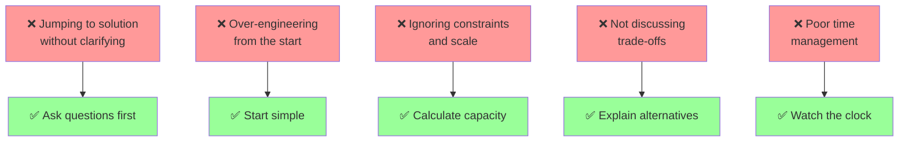
```mermaid
graph TD
    M1[❌ Jumping to solution<br/>without clarifying]
    M2[❌ Over-engineering<br/>from the start]
    M3[❌ Ignoring constraints<br/>and scale]
    M4[❌ Not discussing<br/>trade-offs]
    M5[❌ Poor time<br/>management]

    M1 --> F1[✅ Ask questions first]
    M2 --> F2[✅ Start simple]
    M3 --> F3[✅ Calculate capacity]
    M4 --> F4[✅ Explain alternatives]
    M5 --> F5[✅ Watch the clock]

    style M1 fill:#f99
    style M2 fill:#f99
    style M3 fill:#f99
    style M4 fill:#f99
    style M5 fill:#f99
    style F1 fill:#9f9
    style F2 fill:#9f9
    style F3 fill:#9f9
    style F4 fill:#9f9
    style F5 fill:#9f9
```

---

## 3. Scalability Patterns

### Scaling Journey

```mermaid
graph LR
    S1[1K Users<br/>Single Server] --> S2[10K Users<br/>Add Cache + DB]
    S2 --> S3[100K Users<br/>Load Balancer<br/>+ Replicas]
    S3 --> S4[1M Users<br/>Sharding<br/>+ CDN]
    S4 --> S5[10M+ Users<br/>Microservices<br/>+ Multi-region]

    style S1 fill:#9f9
    style S2 fill:#9cf
    style S3 fill:#ff9
    style S4 fill:#f9c
    style S5 fill:#f9f
```

### Vertical vs Horizontal Scaling

```mermaid
graph TB
    subgraph "Vertical Scaling (Scale Up)"
        V1[Small Server<br/>4 CPU, 8GB RAM] -.->|Upgrade| V2[Big Server<br/>16 CPU, 64GB RAM]
    end

    subgraph "Horizontal Scaling (Scale Out)"
        LB[Load Balancer]
        LB --> H1[Server 1<br/>4 CPU, 8GB]
        LB --> H2[Server 2<br/>4 CPU, 8GB]
        LB --> H3[Server 3<br/>4 CPU, 8GB]
        LB --> H4[Server 4<br/>4 CPU, 8GB]
    end

    style V1 fill:#ff9
    style V2 fill:#9f9
    style LB fill:#f9f
```

### Cache-Aside Pattern

```mermaid
sequenceDiagram
    participant App
    participant Cache
    participant DB

    App->>Cache: Get(key)
    alt Cache Hit
        Cache-->>App: Return value
    else Cache Miss
        Cache-->>App: null
        App->>DB: Query
        DB-->>App: Data
        App->>Cache: Set(key, data)
    end
```

### Geographic Sharding

```mermaid
graph TB
    Router{Geographic Router}

    Router -->|NA Users| US[(US Shard<br/>North America)]
    Router -->|EU Users| EU[(EU Shard<br/>Europe)]
    Router -->|APAC Users| ASIA[(ASIA Shard<br/>Asia Pacific)]

    style Router fill:#f9f,stroke:#333,stroke-width:3px
    style US fill:#9cf
    style EU fill:#9cf
    style ASIA fill:#9cf
```

### Event-Driven Architecture

```mermaid
sequenceDiagram
    participant Order Service
    participant Event Bus
    participant Payment Service
    participant Inventory Service
    participant Notification Service

    Order Service->>Event Bus: OrderCreated Event
    Event Bus->>Payment Service: Process Payment
    Event Bus->>Inventory Service: Reserve Items
    Event Bus->>Notification Service: Send Confirmation

    Payment Service->>Event Bus: PaymentCompleted
    Inventory Service->>Event Bus: ItemsReserved
    Notification Service->>Event Bus: EmailSent
```

### CQRS Pattern

```mermaid
graph TB
    subgraph "Write Side (Commands)"
        WC[Write Commands] --> WDB[(Write DB<br/>Normalized)]
        WDB --> ES[Event Stream]
    end

    subgraph "Read Side (Queries)"
        ES --> R1[(Read Model 1<br/>Denormalized)]
        ES --> R2[(Read Model 2<br/>Cached)]
        ES --> R3[(Read Model 3<br/>Aggregated)]

        R1 --> RQ[Read Queries]
        R2 --> RQ
        R3 --> RQ
    end

    style WDB fill:#f96
    style R1 fill:#9f9
    style R2 fill:#9f9
    style R3 fill:#9f9
```

### Circuit Breaker Pattern

```mermaid
stateDiagram-v2
    [*] --> Closed: Normal Operation

    Closed --> Open: Failures exceed threshold
    Open --> HalfOpen: Timeout expires
    HalfOpen --> Closed: Success
    HalfOpen --> Open: Failure

    note right of Closed
        Allow all requests
        Track failures
    end note

    note right of Open
        Reject all requests
        Return fallback
    end note

    note right of HalfOpen
        Allow limited requests
        Test if recovered
    end note
```

### Rate Limiting: Token Bucket

```mermaid
graph TB
    subgraph "Token Bucket"
        Bucket[Bucket<br/>Capacity: 100<br/>Current: 75]
        Refill[Refill Rate<br/>10 tokens/sec]
    end

    Request1[Request 1] -->|Consume token| Bucket
    Request2[Request 2] -->|Consume token| Bucket
    Request3[Request 3] -->|No tokens| Reject[429 Too Many Requests]

    Refill -.->|Add tokens| Bucket

    style Bucket fill:#9cf
    style Reject fill:#f99
```

### Auto-Scaling

```mermaid
graph TB
    Monitor[Metrics Monitor<br/>CPU, Memory, QPS]

    Monitor --> Decision{Threshold<br/>Exceeded?}

    Decision -->|CPU > 70%| ScaleUp[Scale Up<br/>Add 2 instances]
    Decision -->|CPU < 30%| ScaleDown[Scale Down<br/>Remove 1 instance]
    Decision -->|Normal| Wait[Continue Monitoring]

    ScaleUp --> Instances[Update Instance Count]
    ScaleDown --> Instances
    Instances --> Monitor

    style Decision fill:#f9f
    style ScaleUp fill:#9f9
    style ScaleDown fill:#fc9
```

### Real-World: Twitter Architecture

```mermaid
graph TB
    subgraph "User Actions"
        Post[Post Tweet]
        Read[Read Timeline]
    end

    subgraph "Write Path"
        Post --> WLB[Write Load Balancer]
        WLB --> API1[API Server]
        API1 --> WDB[(Tweet DB Shard)]
        API1 --> Cache[Redis Cache]
        API1 --> MQ[Message Queue]
        MQ --> Worker[Fan-out Worker]
        Worker --> Timeline[(Timeline Cache)]
    end

    subgraph "Read Path"
        Read --> RLB[Read Load Balancer]
        RLB --> API2[API Server]
        API2 --> Timeline
        Timeline -.->|Cache Miss| TDB[(Timeline DB)]
    end

    style WLB fill:#f9f
    style RLB fill:#f9f
    style Cache fill:#9cf
    style Timeline fill:#9cf
```

---

## Quick Reference Tables

### Building Blocks

| Component | Purpose | When to Use |
|-----------|---------|-------------|
| Load Balancer | Distribute traffic | Multiple servers |
| Cache | Speed up reads | Repeated requests |
| Replicas | Scale reads | Read-heavy workload |
| Sharding | Scale writes | Write-heavy workload |
| Message Queue | Async processing | Time-consuming tasks |
| CDN | Serve static files | Global users |

### Scaling Patterns by User Count

| Pattern | Best For | Scale |
|---------|----------|-------|
| Vertical Scaling | Early stage | < 10K users |
| Horizontal Scaling | Growing traffic | 10K-100K |
| Caching | Read-heavy workloads | All scales |
| Replication | Read scalability | 100K+ |
| Sharding | Write scalability | 1M+ |
| Microservices | Large teams | 100K+ |
| Event-Driven | Async workflows | All scales |
| CDN | Global users | All scales |
| CQRS | Complex reads | 1M+ |
| Auto-Scaling | Variable traffic | All scales |

---

## Resources
- [MkDocs Material Theme Documentation](https://squidfunk.github.io/mkdocs-material/)
- [System Design Primer](https://github.com/donnemartin/system-design-primer)

## Practice Problems
- Design a URL Shortener (bit.ly)
- Design Twitter Feed
- Design Instagram
- Design Uber

## Reflections
Today was incredibly productive! Set up the learning environment and dove deep into three major system design topics. The diagram-first approach really helps visualize complex concepts. Key insight: always start simple and scale incrementally - don't over-engineer from the start.

## Next Steps
- [ ] Review FAANG system design plan in detail
- [ ] Complete URL Shortener design exercise
- [ ] Practice back-of-envelope calculations
- [ ] Study real-world case: How Netflix scaled

---

[← Back to Daily Logs](index.md) | [Home](../index.md)
