# Day 2 - October 25, 2024

## Topics Covered
- Consistent Hashing algorithm and implementation
- Stateless vs Stateful architecture patterns
- Load balancer types and deployment strategies

## Key Learnings
- Consistent hashing minimizes key redistribution when nodes are added/removed
- Stateless architectures scale horizontally much easier than stateful ones
- Different load balancer layers serve different purposes (L4 vs L7)
- Virtual nodes help distribute load evenly in consistent hashing

---

## 1. Consistent Hashing

### The Problem: Traditional Hashing


**Issue:** When servers change, most keys get remapped → cache invalidation storm!

### Consistent Hashing Solution

**Core Idea:** Hash both keys AND servers onto a ring (0 to 2^32-1)

```mermaid
graph TB
    subgraph "Hash Ring Concept"
        Ring[("Hash Ring<br/>0 to 2³²-1")]

        S0[Server 0<br/>Hash: 1000] --> Ring
        S1[Server 1<br/>Hash: 5000] --> Ring
        S2[Server 2<br/>Hash: 9000] --> Ring

        K1[Key A<br/>Hash: 2000] -.->|Clockwise to<br/>next server| S1
        K2[Key B<br/>Hash: 6000] -.->|Clockwise to<br/>next server| S2
        K3[Key C<br/>Hash: 500] -.->|Clockwise to<br/>next server| S0
    end

    style Ring fill:#9cf
```



### Visual: Hash Ring


**Rule:** Each key goes to the first server clockwise from its hash position

### Adding a Server


**Benefit:** Only keys between Server 1 (5000) and Server 3 (7000) are remapped!

### The Virtual Nodes Problem

**Problem: Without virtual nodes, servers may get uneven load**

```mermaid
graph LR
    subgraph Uneven["❌ Problem: Uneven Distribution"]
        P1[Server 0<br/>Pos: 1000<br/>Load: 90%]
        P2[Server 1<br/>Pos: 2000<br/>Load: 5%]
        P3[Server 2<br/>Pos: 3000<br/>Load: 5%]
    end

    style P1 fill:#f99
    style P2 fill:#ff9
    style P3 fill:#ff9
```



**Solution: Virtual Nodes - Each physical server gets multiple ring positions**

```mermaid
graph TB
    subgraph Server0["Server 0 (Physical)"]
        S0_1[VNode1: 1000]
        S0_2[VNode2: 5000]
        S0_3[VNode3: 9000]
    end

    subgraph Server1["Server 1 (Physical)"]
        S1_1[VNode1: 2000]
        S1_2[VNode2: 6000]
        S1_3[VNode3: 10000]
    end

    subgraph Server2["Server 2 (Physical)"]
        S2_1[VNode1: 3000]
        S2_2[VNode2: 7000]
        S2_3[VNode3: 11000]
    end

    Result[✅ Result: Each server<br/>handles ~33% of keys]

    style S0_1 fill:#9f9
    style S0_2 fill:#9f9
    style S0_3 fill:#9f9
    style S1_1 fill:#9cf
    style S1_2 fill:#9cf
    style S1_3 fill:#9cf
    style S2_1 fill:#fc9
    style S2_2 fill:#fc9
    style S2_3 fill:#fc9
    style Result fill:#9f9
```



**Virtual Nodes:** Each physical server gets multiple positions on the ring (typically 100-200)

### Consistent Hashing Algorithm


### Real-World Use Cases


### Consistent Hashing vs Simple Hashing

| Aspect | Simple Hash (key % N) | Consistent Hash |
|--------|----------------------|-----------------|
| **Redistribution on add/remove** | ~100% keys remapped | Only K/N keys (K=total keys, N=nodes) |
| **Load distribution** | Perfect if N is stable | Good with virtual nodes |
| **Complexity** | O(1) | O(log N) with binary search |
| **Use case** | Static server count | Dynamic scaling |
| **Cache hit rate on scale** | Drops to ~0% | Maintains ~(N-1)/N hit rate |

### Implementation Pseudocode


---

## 2. Stateless vs Stateful Architecture

### Stateful Architecture

```mermaid
graph TB
    Client1[Client A] --> LB[Load Balancer]
    Client2[Client B] --> LB

    LB -->|Session 1| S1[Server 1<br/>💾 Session Data:<br/>User A logged in<br/>Cart: 3 items]
    LB -->|Session 2| S2[Server 2<br/>💾 Session Data:<br/>User B logged in<br/>Cart: 1 item]

    Client1 -.->|Next request<br/>MUST go to Server 1| S1

    style S1 fill:#f99
    style S2 fill:#f99
```



**Problem:** Client is "stuck" to specific server (sticky sessions)

### Stateless Architecture


**Benefit:** Any server can handle any request - perfect for horizontal scaling!

### Session Storage Comparison

```mermaid
graph LR
    subgraph "Stateful: Server-Side Sessions"
        SF1[Server 1<br/>Session Store]
        SF2[Server 2<br/>Session Store]
        SF3[Server 3<br/>Session Store]

        Problem[❌ Session affinity required<br/>❌ Lost on server failure<br/>❌ Hard to scale]
    end

    subgraph "Stateless: External Session Store"
        SL1[Server 1]
        SL2[Server 2]
        SL3[Server 3]

        SL1 & SL2 & SL3 --> Redis[(Redis Cluster)]

        Benefit[✅ No session affinity<br/>✅ Survives server failure<br/>✅ Easy to scale]
    end

    style SF1 fill:#f99
    style SF2 fill:#f99
    style SF3 fill:#f99
    style SL1 fill:#9f9
    style SL2 fill:#9f9
    style SL3 fill:#9f9
```



### Stateless Authentication Flow


### Stateless Design Patterns


### State Migration Strategy


### Comparison Table

| Aspect | Stateful | Stateless |
|--------|----------|-----------|
| **Scaling** | Vertical only (complex horizontal) | Easy horizontal scaling |
| **Load balancing** | Requires sticky sessions | Any server handles any request |
| **Failure handling** | Lost sessions on crash | Sessions survive server failures |
| **Deployment** | Complex (session drain) | Simple (just add/remove servers) |
| **Memory usage** | High (stores all sessions) | Low (compute only) |
| **Database load** | Lower (cached locally) | Higher (external lookups) |
| **Latency** | Lower (local access) | Slightly higher (network call) |
| **Use cases** | WebSockets, gaming servers | REST APIs, microservices |

---

## 3. Load Balancer Types

### Layer 4 (Transport Layer) Load Balancer


**Characteristics:**
- Works at TCP/UDP level
- Inspects: IP address, Port
- Fast (no HTTP parsing)
- Cannot route based on URL or headers

### Layer 7 (Application Layer) Load Balancer


**Characteristics:**
- Works at HTTP/HTTPS level
- Inspects: URL, headers, cookies, body
- Slower (parses HTTP)
- Can route based on content

### L4 vs L7 Comparison


### Deployment Strategies

#### Strategy 1: DNS Round Robin

```mermaid
graph TB
    Client[Client] -->|1. DNS Query<br/>example.com| DNS[DNS Server]
    DNS -->|2. Returns IPs<br/>Rotating list| Client

    Client -->|3. Connect to IP| S1[Server 1<br/>1.2.3.4]
    Client -.->|Next time| S2[Server 2<br/>1.2.3.5]
    Client -.->|Next time| S3[Server 3<br/>1.2.3.6]

    Problem[❌ No health checks<br/>❌ Uneven distribution<br/>❌ DNS caching issues]

    style DNS fill:#ff9
```



#### Strategy 2: Single Load Balancer

```mermaid
graph TB
    Client[Clients] --> LB[Load Balancer<br/>Single Point of Failure!]

    LB --> S1[Server 1]
    LB --> S2[Server 2]
    LB --> S3[Server 3]

    Problem[❌ SPOF<br/>❌ Limited capacity<br/>✅ Simple setup]

    style LB fill:#f99
```



#### Strategy 3: Active-Passive LB

```mermaid
graph TB
    Client[Clients] --> VIP[Virtual IP<br/>10.0.0.100]

    VIP --> Active[Active LB<br/>Handles traffic<br/>Heartbeat every 1s]

    Active -.->|Heartbeat| Passive[Passive LB<br/>Standby mode]

    Passive -.->|Takes over if<br/>Active fails| VIP

    Active --> S1[Server 1]
    Active --> S2[Server 2]
    Active --> S3[Server 3]

    style Active fill:#9f9
    style Passive fill:#9cf
```

#### Strategy 4: Active-Active LB (Best)

```mermaid
graph TB
    Client[Clients] --> DNS[DNS<br/>Round-robin]

    DNS --> LB1[Load Balancer 1<br/>Handles 50% traffic]
    DNS --> LB2[Load Balancer 2<br/>Handles 50% traffic]

    LB1 --> Pool[Server Pool]
    LB2 --> Pool

    Pool --> S1[Server 1]
    Pool --> S2[Server 2]
    Pool --> S3[Server 3]
    Pool --> S4[Server 4]

    Benefits[✅ No SPOF<br/>✅ Better capacity<br/>✅ Both LBs utilized]

    style LB1 fill:#9f9
    style LB2 fill:#9f9
```

### Multi-Tier Load Balancing

```mermaid
graph TB
    Internet[Internet] --> DNS[DNS<br/>Global Load Balancer]

    DNS -->|Geographic routing| US[US Region]
    DNS -->|Geographic routing| EU[EU Region]
    DNS -->|Geographic routing| ASIA[Asia Region]

    US --> US_L4[L4 Load Balancer<br/>AWS NLB]
    EU --> EU_L4[L4 Load Balancer<br/>AWS NLB]

    US_L4 --> US_L7[L7 Load Balancer<br/>AWS ALB]
    EU_L4 --> EU_L7[L7 Load Balancer<br/>AWS ALB]

    US_L7 -->|/api/*| US_API[API Servers]
    US_L7 -->|/static/*| US_CDN[CDN Servers]

    EU_L7 -->|/api/*| EU_API[API Servers]
    EU_L7 -->|/static/*| EU_CDN[CDN Servers]

    style DNS fill:#9cf
    style US_L4 fill:#9cf
    style EU_L4 fill:#9cf
    style US_L7 fill:#f9f
    style EU_L7 fill:#f9f
```

### Load Balancer Algorithms Deep Dive

```mermaid
graph TD
    Start{Select Algorithm}

    Start -->|Simple| RR[Round Robin<br/>S1→S2→S3→S1...]
    Start -->|Weighted| WRR[Weighted Round Robin<br/>S1: 3x, S2: 2x, S3: 1x]
    Start -->|Performance| LC[Least Connections<br/>Route to least busy]
    Start -->|Geographic| GEO[Geographic<br/>Route to nearest]
    Start -->|Sticky| HASH[Consistent Hash<br/>Same client → Same server]
    Start -->|Smart| AI[Least Response Time<br/>Track actual latency]

    RR --> Use1[Use: Equal capacity servers<br/>Simple workloads]
    WRR --> Use2[Use: Different server sizes<br/>e.g., 2x capacity server]
    LC --> Use3[Use: Long-lived connections<br/>WebSockets, databases]
    GEO --> Use4[Use: Global users<br/>Latency-sensitive apps]
    HASH --> Use5[Use: Session affinity needed<br/>Stateful apps]
    AI --> Use6[Use: Variable backend latency<br/>Optimal performance]

    style RR fill:#9f9
    style WRR fill:#9cf
    style LC fill:#ff9
    style HASH fill:#f9c
```

### Health Checks

```mermaid
sequenceDiagram
    participant LB as Load Balancer
    participant S1 as Server 1 (Healthy)
    participant S2 as Server 2 (Unhealthy)
    participant S3 as Server 3 (Healthy)

    loop Every 5 seconds
        LB->>S1: GET /health
        S1-->>LB: 200 OK

        LB->>S2: GET /health
        S2-->>LB: Timeout / 500 Error

        LB->>S3: GET /health
        S3-->>LB: 200 OK
    end

    Note over LB,S2: S2 marked unhealthy<br/>Removed from rotation

    LB->>S1: Route traffic
    LB->>S3: Route traffic
    LB-xS2: No traffic sent

    Note over LB,S2: After 3 successful checks,<br/>S2 added back to rotation
```

### Popular Load Balancers

```mermaid
mindmap
  root((Load<br/>Balancers))
    Hardware
      F5 BIG-IP
      Citrix ADC
      A10 Networks
      Expensive, powerful
    Software
      HAProxy
      NGINX
      Envoy
      Traefik
      Free, flexible
    Cloud
      AWS ELB/ALB/NLB
      GCP Load Balancer
      Azure Load Balancer
      Cloudflare
      Managed, scalable
    Service Mesh
      Istio
      Linkerd
      Consul
      App-level routing
```

---

## Quick Reference Tables

### When to Use What?

| Scenario | Solution | Why? |
|----------|----------|------|
| **Caching layer with 100 servers** | Consistent Hashing | Minimize cache invalidation on scale |
| **REST API servers** | Stateless + L7 LB | Easy scaling, content routing |
| **WebSocket gaming server** | Stateful + L4 LB + Sticky sessions | Maintain connection state |
| **Global CDN** | Multi-tier LB + Geo routing | Low latency worldwide |
| **Database connection pool** | Consistent Hashing | Reuse connections per shard |
| **Microservices routing** | Stateless + Service Mesh | Dynamic routing, observability |

### Technology Stack Examples

| Component | Layer 4 | Layer 7 | Stateless Store |
|-----------|---------|---------|-----------------|
| **AWS** | Network Load Balancer (NLB) | Application Load Balancer (ALB) | ElastiCache Redis |
| **GCP** | TCP/UDP Load Balancer | HTTP(S) Load Balancer | Cloud Memorystore |
| **Azure** | Load Balancer | Application Gateway | Azure Cache for Redis |
| **Open Source** | HAProxy (TCP mode) | NGINX, HAProxy (HTTP mode) | Redis Cluster |

---

## Practice Problems

1. **Design Instagram's feed cache**: Use consistent hashing to distribute user feeds across 500 cache servers
2. **Design Uber's matching service**: Should it be stateful or stateless? Why?
3. **Design a global API**: Use multi-tier load balancing (DNS → L4 → L7)
4. **Migrate from stateful to stateless**: Plan the migration for a monolith with server-side sessions

## Resources
- [Consistent Hashing Paper](https://www.akamai.com/us/en/multimedia/documents/technical-publication/consistent-hashing-and-random-trees-distributed-caching-protocols-for-relieving-hot-spots-on-the-world-wide-web-technical-publication.pdf)
- [HAProxy Documentation](http://www.haproxy.org/)
- [NGINX Load Balancing Guide](https://docs.nginx.com/nginx/admin-guide/load-balancer/)

## Reflections
Consistent hashing is brilliant - it's all about minimizing the blast radius when systems change. The virtual nodes trick ensures even distribution. Stateless architecture is the foundation of modern cloud-native apps - any server can die without data loss. Layer 7 load balancers are slower but give you powerful routing capabilities.

## Next Steps
- [ ] Implement consistent hashing in code
- [ ] Draw architecture for Twitter's timeline cache with consistent hashing
- [ ] Compare AWS ALB vs NLB for a specific use case
- [ ] Design session management for a stateless e-commerce app

---

[← Back to Daily Logs](index.md) | [Home](../index.md)
