# Day 3 - October 29, 2024

## Topics Covered
- The Three Pillars: Reliability, Scalability, and Maintainability
- Data-intensive application architecture
- Fault tolerance and redundancy patterns
- System design trade-offs

## Key Learnings
- Reliability means working correctly even when things go wrong (fault tolerance)
- Scalability is about handling increased load without redesigning the system
- Maintainability enables engineers to work efficiently on the system over time
- These three concerns are non-functional requirements that drive every design decision
- Good architecture shows clear separation of concerns and modular design

---

## The Foundation: Three Pillars of Data Systems

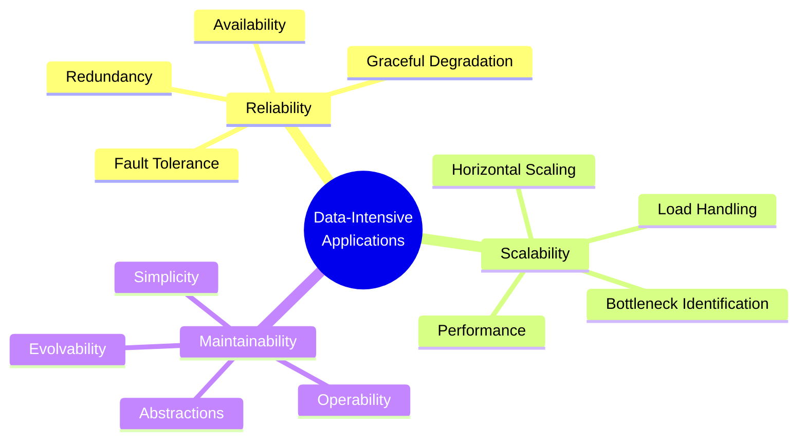

---

## Data-Intensive Application Architecture

### The Four-Layer Model

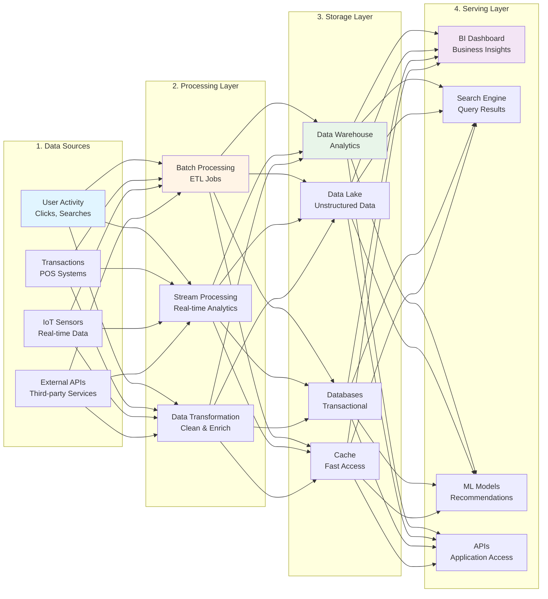

**Restaurant Kitchen Analogy:**
- **Data Sources** = Raw ingredients from suppliers
- **Processing** = Chefs washing, chopping, cooking
- **Storage** = Refrigerators and prep stations
- **Serving** = Plated dishes to customers

---

## 1. Reliability (Fault Tolerance)

**Definition:** The system continues to work correctly, even when things go wrong

### Faults vs Failures

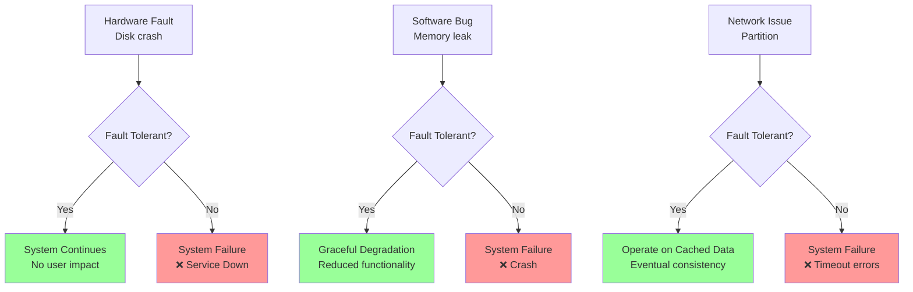

**Key Insight:** Fault = One component failing | Failure = System unavailable to users

### Redundancy Pattern

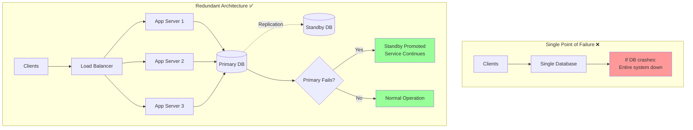

### Types of Faults

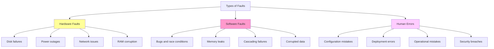

### E-commerce Reliability Example

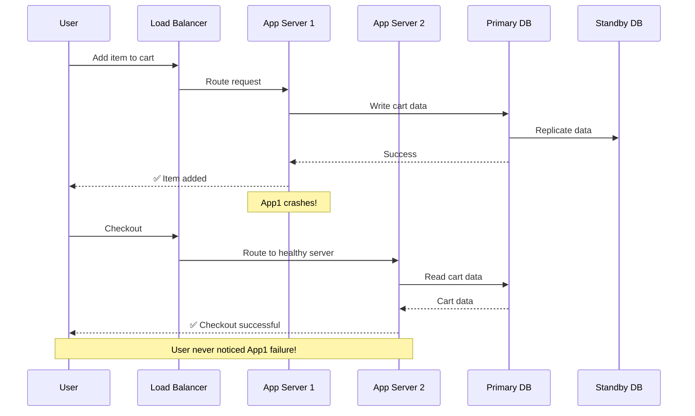

**Reliability Goal:** Customer completes purchase even if servers fail in the background

### Reliability Techniques

| Technique | Description | Example |
|-----------|-------------|---------|
| **Replication** | Multiple copies of data | Database replicas |
| **Redundancy** | Duplicate components | Multiple servers |
| **Failover** | Automatic switchover | Standby database promotion |
| **Circuit Breaker** | Prevent cascading failures | Stop calling failed service |
| **Timeouts** | Don't wait forever | 5-second request timeout |
| **Retry Logic** | Try again on transient errors | Retry with exponential backoff |
| **Health Checks** | Detect failures early | /health endpoint every 10s |
| **Graceful Degradation** | Reduced functionality vs total failure | Show cached data if DB down |

---

## 2. Scalability

**Definition:** The system can handle increased load without major redesign

### Load Parameters

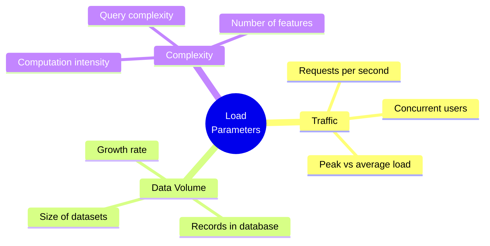

### Identifying Bottlenecks

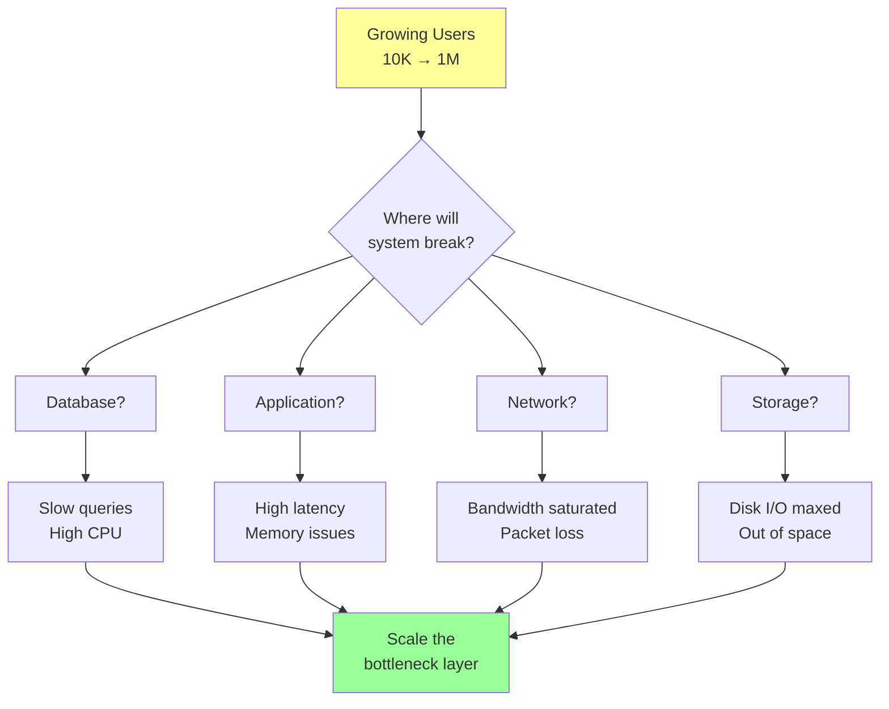

### Horizontal vs Vertical Scaling

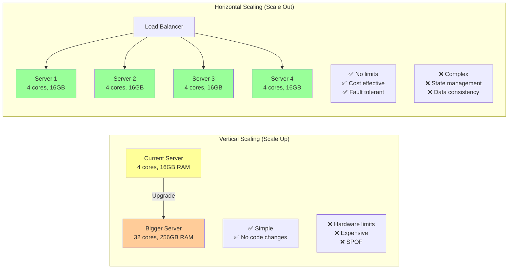

### Modular Architecture for Scalability

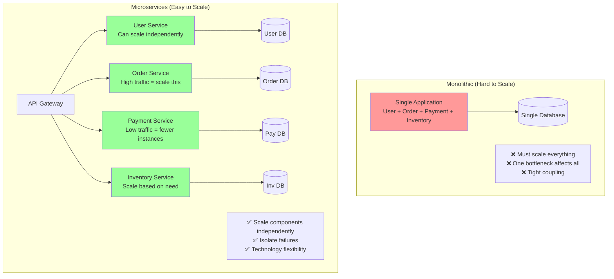

### Social Media Scalability Example

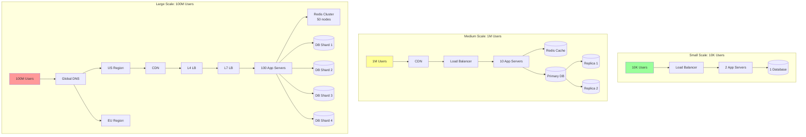

**Key Insight:** Scalability requires planning for each growth stage

### Performance Metrics

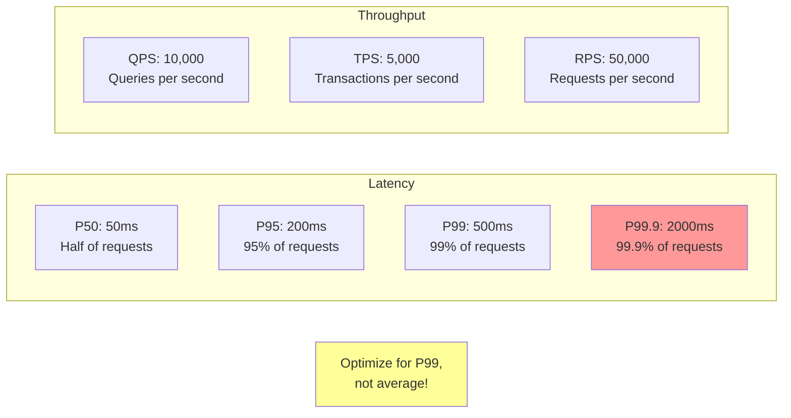

**Why P99 matters:** Amazon found 1% of slowest requests = most valuable customers (largest carts)

---

## 3. Maintainability

**Definition:** Engineers can work efficiently on the system over time

### The Three Dimensions

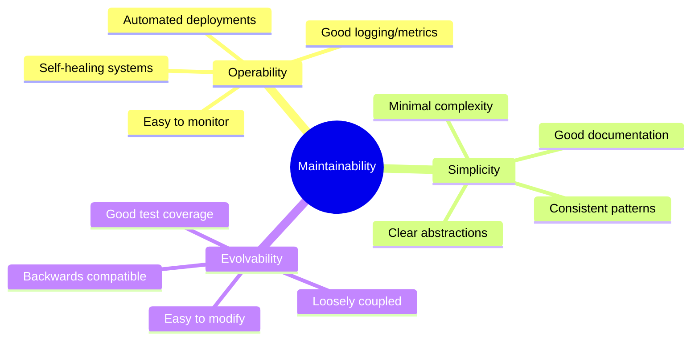

### Good vs Bad Architecture

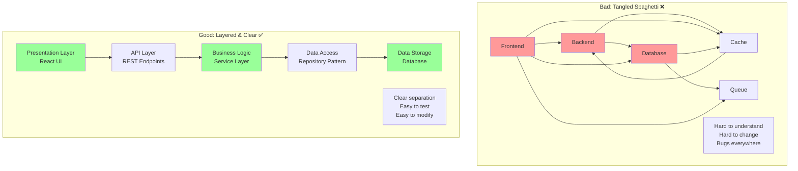

### Abstractions in Action

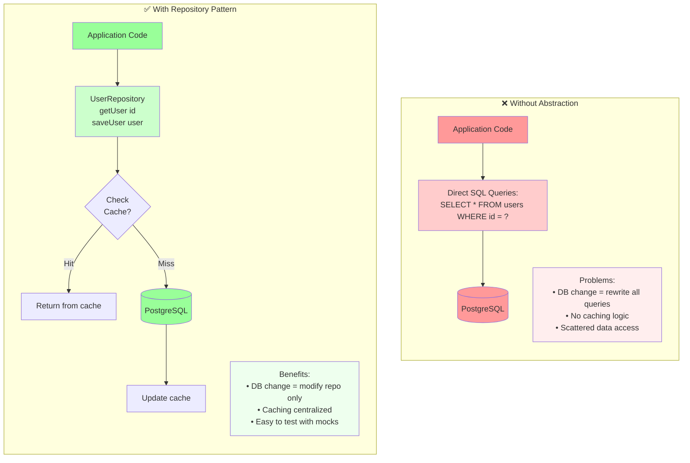

### Maintainability Practices

| Practice | Description | Benefit |
|----------|-------------|---------|
| **Logging** | Structured logs with context | Debug production issues |
| **Metrics** | Track KPIs and health | Early problem detection |
| **Monitoring** | Dashboards and alerts | Know when things break |
| **Documentation** | Architecture diagrams, APIs | Onboard new engineers fast |
| **Testing** | Unit, integration, E2E tests | Confidence in changes |
| **Code Reviews** | Peer review all changes | Catch bugs, share knowledge |
| **CI/CD** | Automated build and deploy | Fast, reliable releases |
| **Feature Flags** | Toggle features on/off | Safe rollouts, easy rollback |

### Technical Debt Management

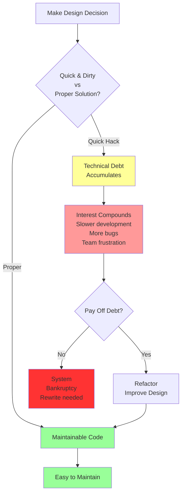

**Golden Rule:** It's easier to keep code clean than to clean up later

---

## The Trade-off Triangle

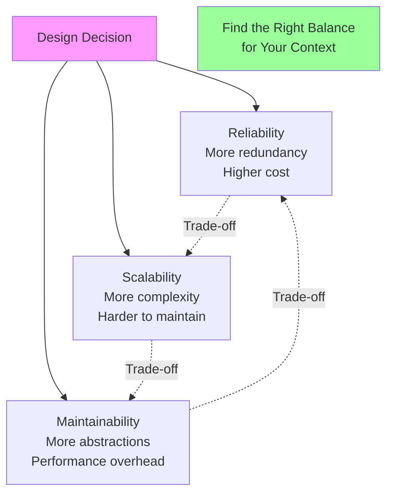

**Context Matters:**
- **Startup MVP**: Prioritize speed → Maintainability can wait
- **Banking System**: Prioritize reliability → Cost is secondary
- **Scaling Unicorn**: Prioritize scalability → Invest in complexity
- **Mature Product**: Prioritize maintainability → Long-term stability

---

## Real-World Examples

### Netflix: All Three Pillars

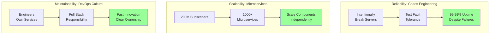

### Amazon: Customer Obsession Through Design

| Pillar | Amazon's Approach | Impact |
|--------|------------------|--------|
| **Reliability** | Multiple availability zones, redundant everything | Customer can always buy |
| **Scalability** | Service-oriented architecture, auto-scaling | Handle Prime Day traffic |
| **Maintainability** | Two-pizza teams, API-first design | Fast feature development |

---

## Quick Reference: The Three Pillars

| Pillar | Question to Ask | Measure | Techniques |
|--------|----------------|---------|------------|
| **Reliability** | Does it work correctly, even when things go wrong? | Uptime %, Error rate | Redundancy, Replication, Failover |
| **Scalability** | Can it handle growth without redesign? | Latency (P99), Throughput (QPS) | Horizontal scaling, Sharding, Caching |
| **Maintainability** | Can engineers work efficiently? | Time to fix bugs, Deploy frequency | Abstractions, Testing, Documentation |

---

## Practice Problems

1. **Design Twitter's timeline**: How would you ensure reliability for 200M users?
2. **E-commerce checkout**: What scalability challenges arise during Black Friday?
3. **Refactor Legacy System**: How to improve maintainability without breaking production?
4. **Trade-off Analysis**: When would you sacrifice reliability for faster time-to-market?

## Resources
- [Designing Data-Intensive Applications](https://dataintensive.net/) by Martin Kleppmann
- [Site Reliability Engineering](https://sre.google/books/) by Google
- [The Twelve-Factor App](https://12factor.net/)

## Reflections
The three pillars aren't just technical concerns - they're business imperatives. Reliability affects revenue (downtime = lost sales). Scalability affects growth (can't handle traffic = lose users). Maintainability affects speed (tech debt = slow innovation). Every design decision is a trade-off between these concerns. The key is understanding your context and choosing the right balance.

## Next Steps
- [ ] Read "Designing Data-Intensive Applications" Chapter 1
- [ ] Analyze a system you use: Which pillar is prioritized?
- [ ] Design a fault-tolerant database architecture
- [ ] Create a monitoring dashboard for a sample application

---

[← Back to Daily Logs](index.md) | [Home](../index.md)
