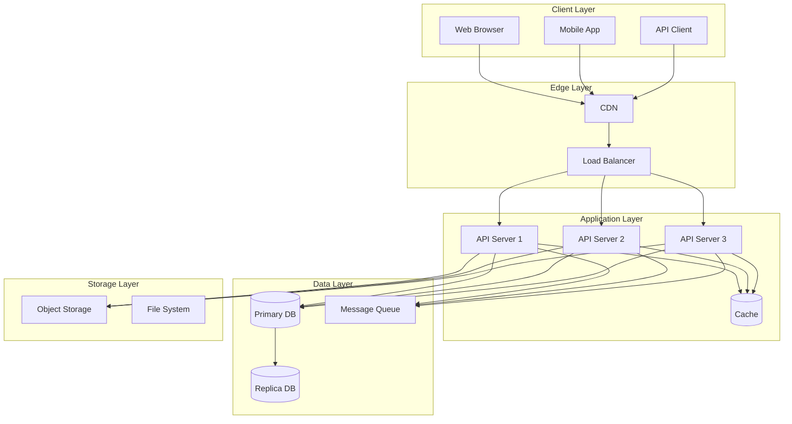
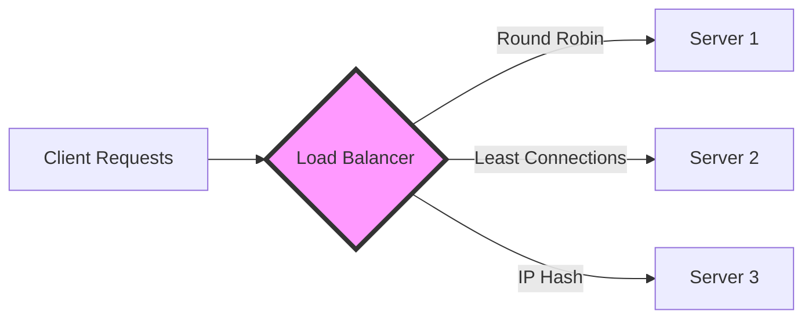
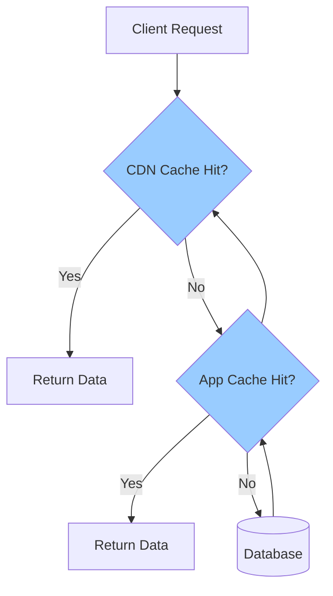
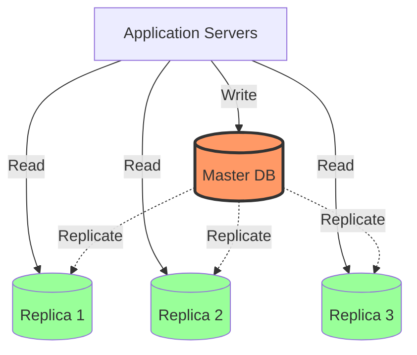
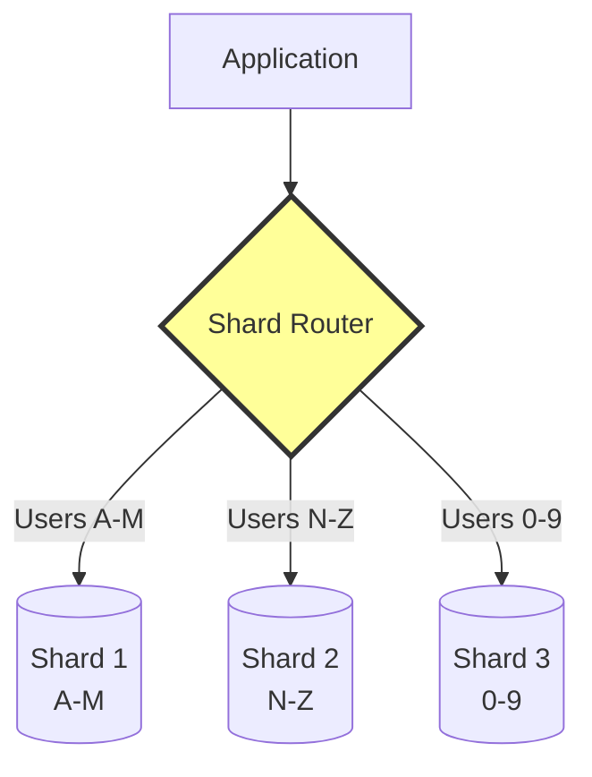
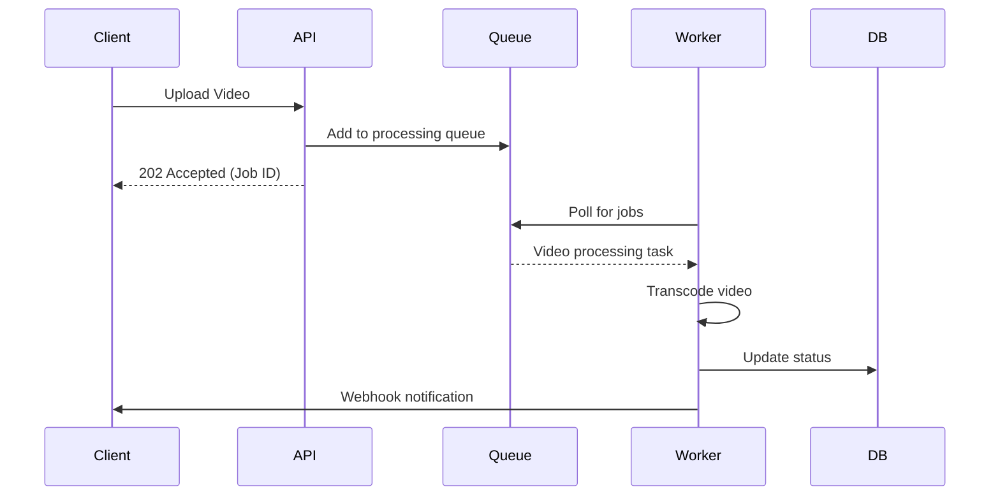
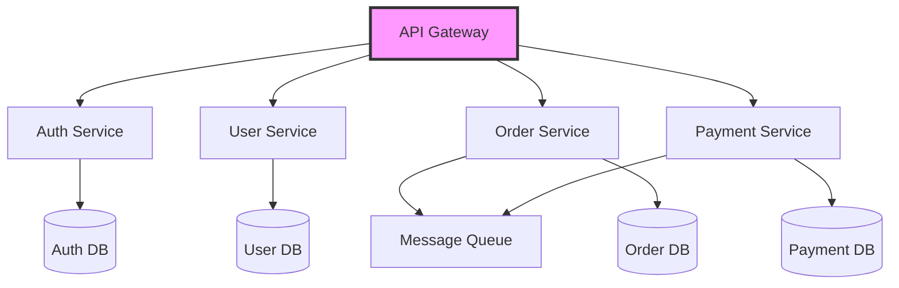
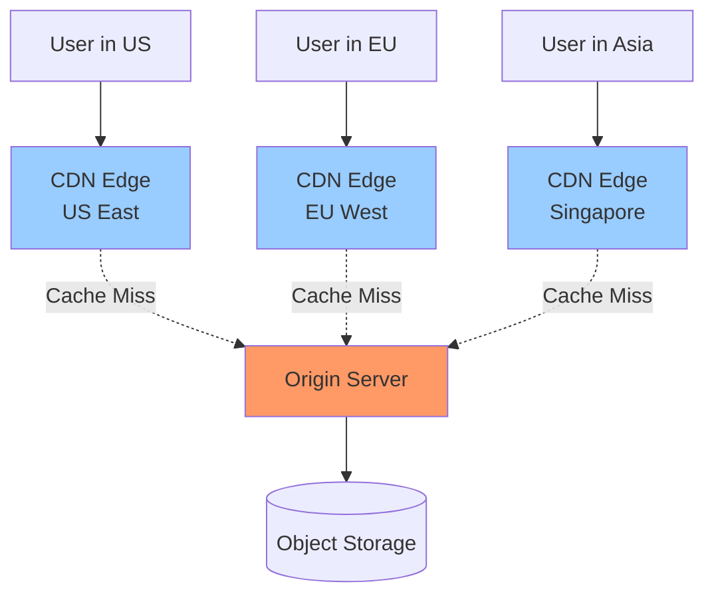
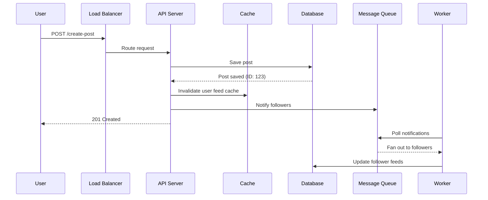

# Fundamental Building Blocks of Distributed Systems

The core components that power large-scale systems.

---

## System Architecture Overview

---

## 1. Load Balancers

Distribute traffic across multiple servers.

**Key Algorithms:**
- Round Robin: Distribute evenly
- Least Connections: Route to least busy server
- IP Hash: Consistent routing per client

---

## 2. Caching Layers

**Cache Levels:**
- **CDN**: Static assets (images, CSS, JS)
- **Application**: Session data, API responses
- **Database**: Query results

---

## 3. Database Patterns

### Master-Replica Replication

### Database Sharding

**Sharding Strategies:**
- Range-based (A-M, N-Z)
- Hash-based (user_id % num_shards)
- Geographic (US, EU, ASIA)

---

## 4. Message Queues

Asynchronous processing and decoupling.

**Use Cases:**
- Video/image processing
- Email delivery
- Report generation
- Background tasks

---

## 5. Microservices Communication

**Key Patterns:**
- API Gateway: Single entry point
- Service Discovery: Find service instances
- Circuit Breaker: Handle failures gracefully

---

## 6. CDN (Content Delivery Network)

**Benefits:**
- Reduced latency (serve from nearby edge)
- Reduced load on origin servers
- DDoS protection

---

## 7. Data Flow Example: Social Media Post

---

## Key Takeaways

| Component | Purpose | When to Use |
|-----------|---------|-------------|
| **Load Balancer** | Distribute traffic | Multiple servers |
| **Cache** | Speed up reads | Repeated requests |
| **Replicas** | Scale reads | Read-heavy workload |
| **Sharding** | Scale writes | Write-heavy workload |
| **Message Queue** | Async processing | Time-consuming tasks |
| **CDN** | Serve static files | Global users |

---

[← Back to Topics](index.md) | [Home](../index.md)
