# System Design Interview Approach

How FAANG companies evaluate system design skills.

---

## Interview Flow

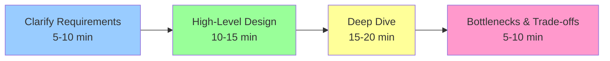

---

## Step 1: Requirements Clarification

```mermaid
mindmap
  root((Requirements))
    Functional
      Core features?
      User actions?
      API endpoints?
    Non-Functional
      Scale (Users/QPS)?
      Latency targets?
      Consistency needs?
    Constraints
      Budget?
      Technology stack?
      Timeline?
```

**Key Questions to Ask:**
- How many users? (DAU/MAU)
- Read vs Write ratio?
- Peak traffic patterns?
- Data retention period?
- Geographic distribution?

---

## Step 2: Capacity Estimation

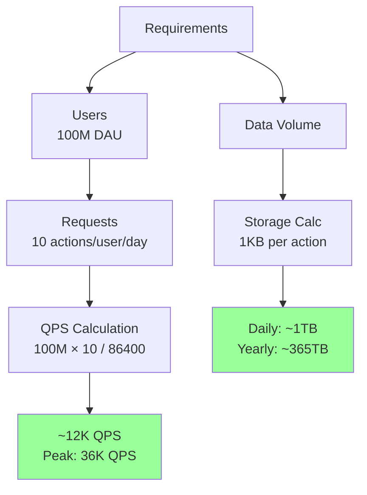

**Back-of-envelope Math:**
- QPS = (DAU × actions) / 86,400
- Peak QPS = Average QPS × 3
- Storage = QPS × data_size × seconds_per_day

---

## Step 3: API Design

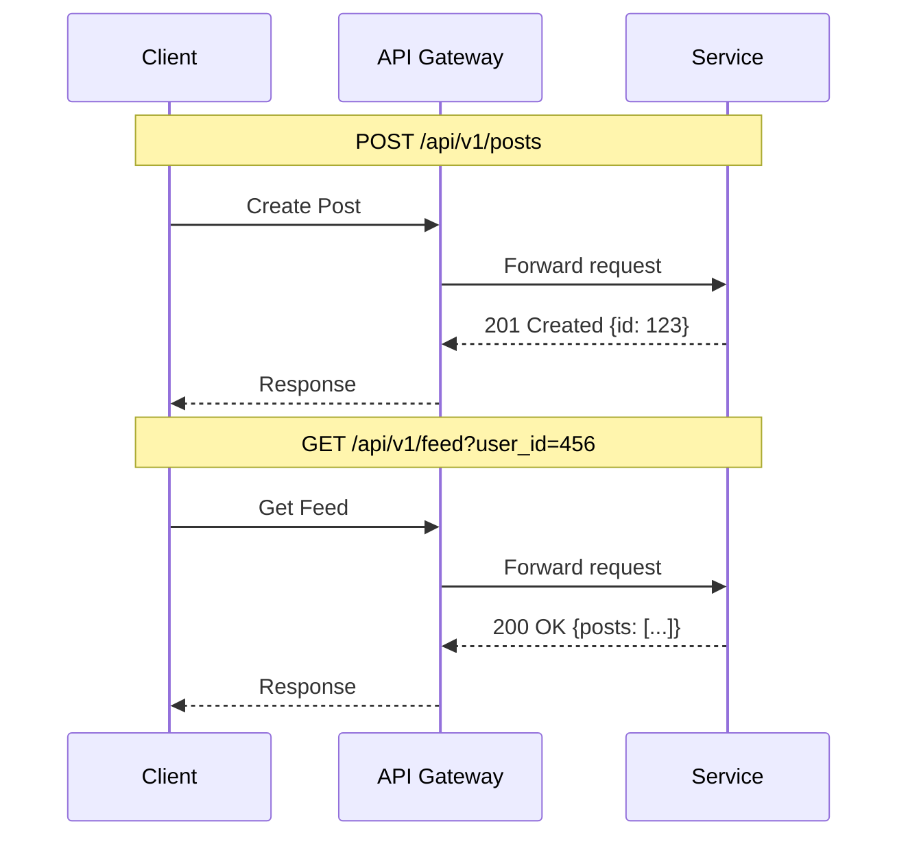

**Define Key APIs Early:**
- `POST /posts` - Create content
- `GET /feed` - Retrieve content
- `PUT /posts/:id` - Update content
- `DELETE /posts/:id` - Remove content

---

## Step 4: High-Level Design

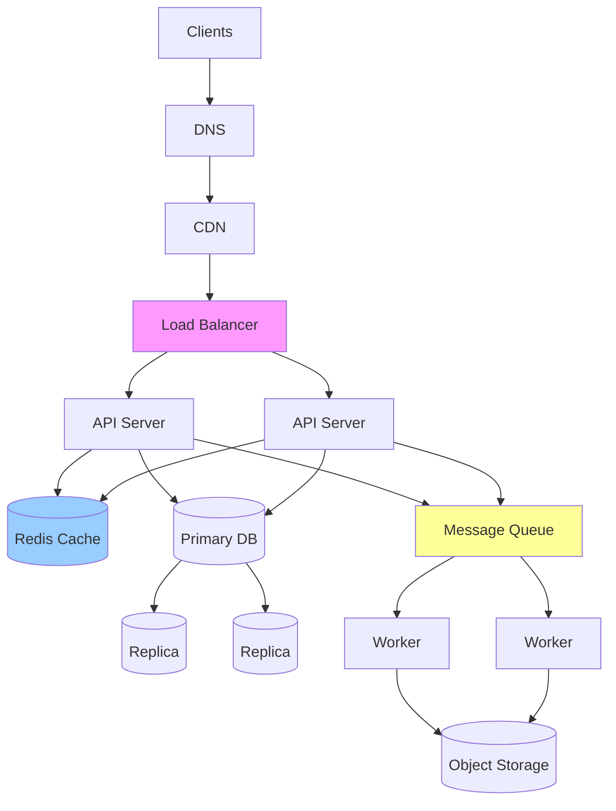

**Start Simple, Then Iterate:**
1. Client → Server → Database
2. Add load balancer (multiple servers)
3. Add caching layer
4. Add database replicas
5. Add message queues for async tasks

---

## Step 5: Deep Dive Areas

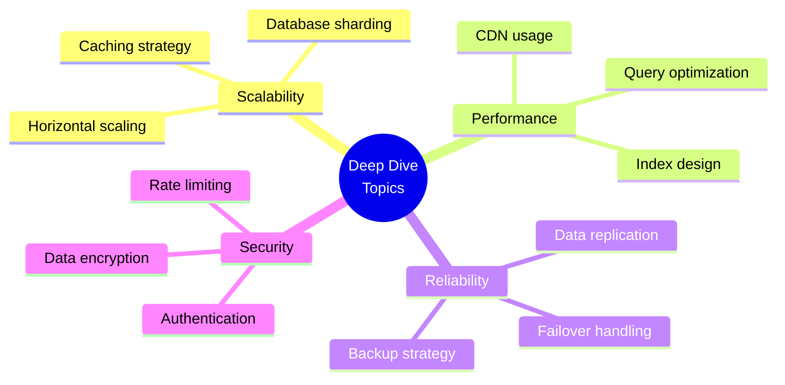

**Interviewer May Ask:**
- "How do you handle 10x traffic?"
- "What if the cache fails?"
- "How do you ensure consistency?"
- "What about data privacy?"

---

## Step 6: Bottleneck Analysis

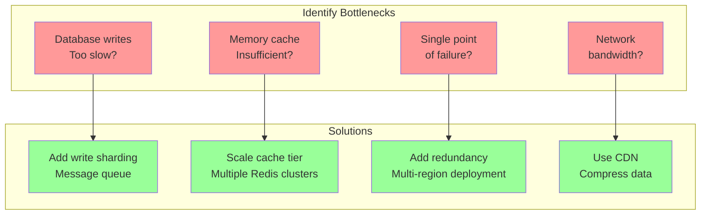

---

## Trade-offs Discussion

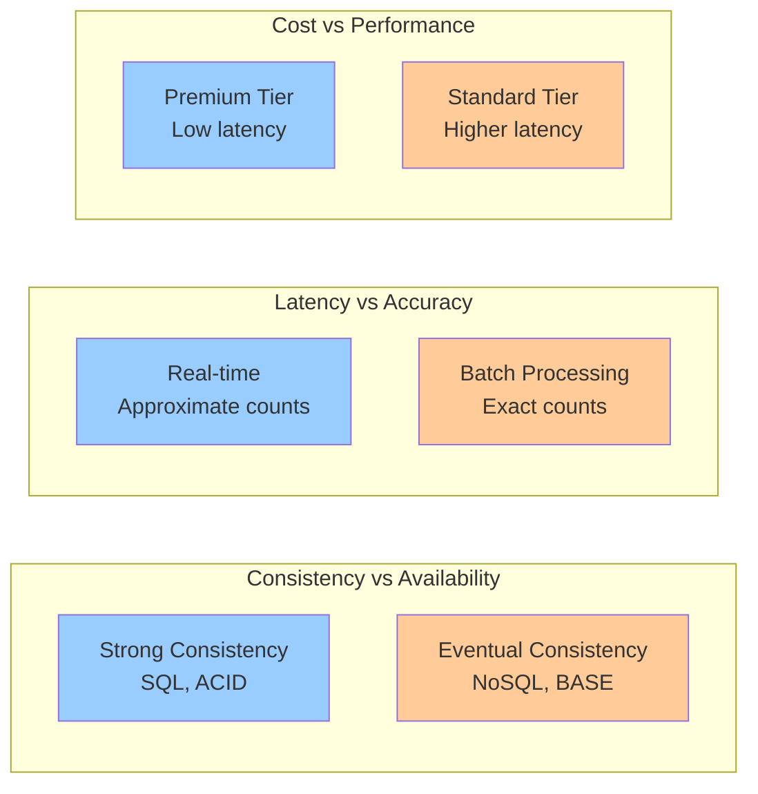

**Common Trade-offs:**
- **CAP Theorem**: Consistency vs Availability vs Partition Tolerance
- **Latency vs Consistency**: Fast reads vs accurate data
- **Storage vs Compute**: Denormalization vs joins
- **Cost vs Performance**: Premium infrastructure vs budget constraints

---

## Evaluation Criteria

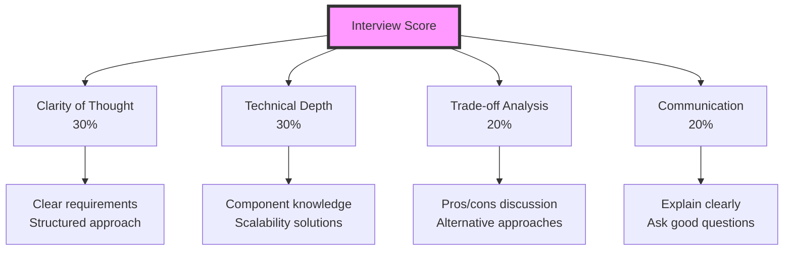

---

## Common Mistakes to Avoid

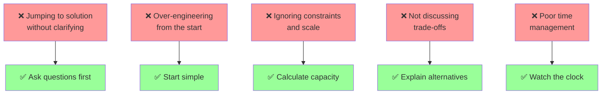

---

## Interview Time Management

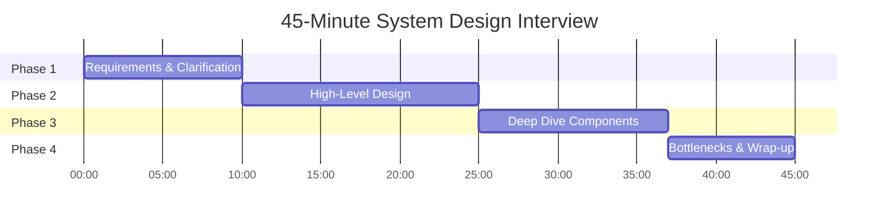

---

## Practice Problems by Difficulty

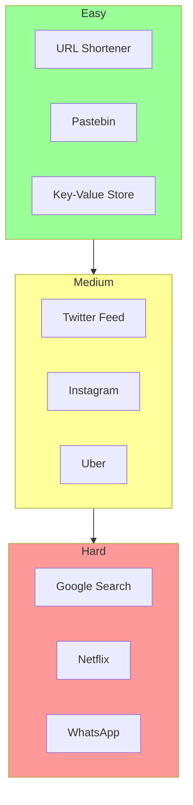

---

## Key Takeaways

1. **Always clarify first** - Don't assume requirements
2. **Start simple** - Build incrementally
3. **Numbers matter** - Do back-of-envelope calculations
4. **Think out loud** - Communicate your reasoning
5. **Discuss trade-offs** - There's no perfect solution
6. **Practice regularly** - Muscle memory is key

---

[← Back to Topics](index.md) | [Home](../index.md)
