# Common Scalability Patterns

Proven approaches to scale systems from thousands to millions of users.

---

## Scaling Journey Overview

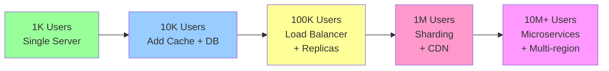
```mermaid
graph LR
    S1[1K Users<br/>Single Server] --> S2[10K Users<br/>Add Cache + DB]
    S2 --> S3[100K Users<br/>Load Balancer<br/>+ Replicas]
    S3 --> S4[1M Users<br/>Sharding<br/>+ CDN]
    S4 --> S5[10M+ Users<br/>Microservices<br/>+ Multi-region]

    style S1 fill:#9f9
    style S2 fill:#9cf
    style S3 fill:#ff9
    style S4 fill:#f9c
    style S5 fill:#f9f
```

---

## Pattern 1: Vertical Scaling (Scale Up)

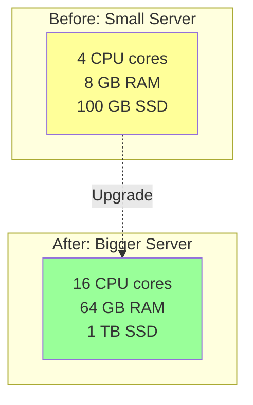
```mermaid
graph TB
    subgraph "Before: Small Server"
        B1[4 CPU cores<br/>8 GB RAM<br/>100 GB SSD]
    end

    subgraph "After: Bigger Server"
        A1[16 CPU cores<br/>64 GB RAM<br/>1 TB SSD]
    end

    B1 -.->|Upgrade| A1

    style B1 fill:#ff9
    style A1 fill:#9f9
```

**Pros:** Simple, no code changes
**Cons:** Hardware limits, single point of failure, expensive
**Use When:** Early stage, quick fix needed

---

## Pattern 2: Horizontal Scaling (Scale Out)

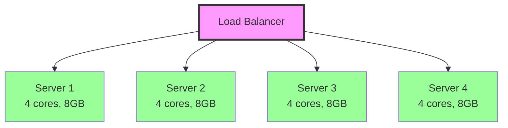
```mermaid
graph TB
    LB[Load Balancer]

    LB --> S1[Server 1<br/>4 cores, 8GB]
    LB --> S2[Server 2<br/>4 cores, 8GB]
    LB --> S3[Server 3<br/>4 cores, 8GB]
    LB --> S4[Server 4<br/>4 cores, 8GB]

    style LB fill:#f9f,stroke:#333,stroke-width:3px
    style S1 fill:#9f9
    style S2 fill:#9f9
    style S3 fill:#9f9
    style S4 fill:#9f9
```

**Pros:** No limits, redundancy, cost-effective
**Cons:** Complexity, stateless requirements
**Use When:** Growth expected, high availability needed

---

## Pattern 3: Caching Strategy

### Cache Aside Pattern

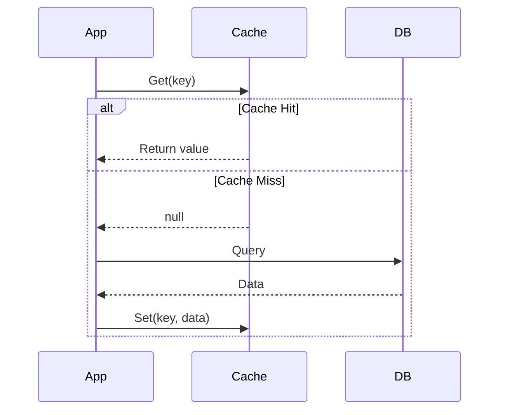
```mermaid
sequenceDiagram
    participant App
    participant Cache
    participant DB

    App->>Cache: Get(key)
    alt Cache Hit
        Cache-->>App: Return value
    else Cache Miss
        Cache-->>App: null
        App->>DB: Query
        DB-->>App: Data
        App->>Cache: Set(key, data)
    end
```

### Write-Through Cache

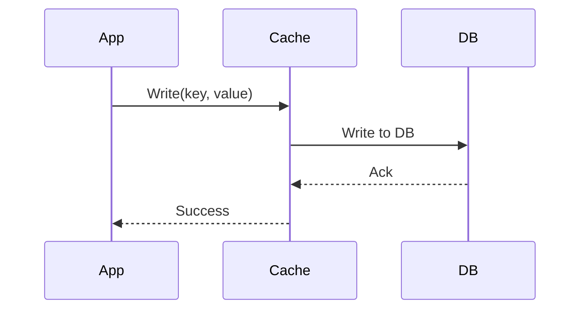
```mermaid
sequenceDiagram
    participant App
    participant Cache
    participant DB

    App->>Cache: Write(key, value)
    Cache->>DB: Write to DB
    DB-->>Cache: Ack
    Cache-->>App: Success
```

### Cache Layers

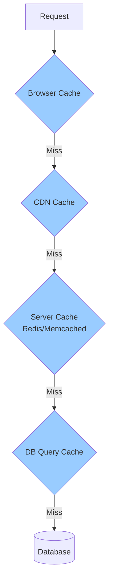
```mermaid
graph TB
    Request[Request] --> L1{Browser Cache}
    L1 -->|Miss| L2{CDN Cache}
    L2 -->|Miss| L3{Server Cache<br/>Redis/Memcached}
    L3 -->|Miss| L4{DB Query Cache}
    L4 -->|Miss| DB[(Database)]

    style L1 fill:#9cf
    style L2 fill:#9cf
    style L3 fill:#9cf
    style L4 fill:#9cf
```

---

## Pattern 4: Database Replication

### Master-Slave Replication

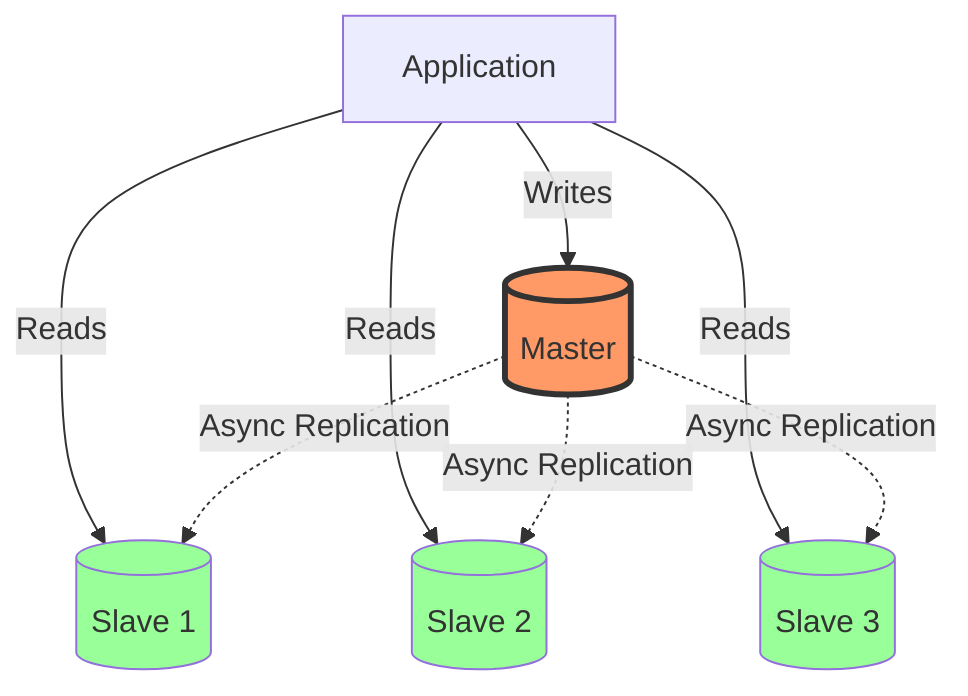
```mermaid
graph TB
    App[Application]

    App -->|Writes| M[(Master)]
    App -->|Reads| R1[(Slave 1)]
    App -->|Reads| R2[(Slave 2)]
    App -->|Reads| R3[(Slave 3)]

    M -.->|Async Replication| R1
    M -.->|Async Replication| R2
    M -.->|Async Replication| R3

    style M fill:#f96,stroke:#333,stroke-width:3px
    style R1 fill:#9f9
    style R2 fill:#9f9
    style R3 fill:#9f9
```

**Read/Write Split:**
- Master: Handle all writes
- Slaves: Handle read queries
- Ratio: Often 90% reads, 10% writes

---

## Pattern 5: Database Sharding

### Horizontal Partitioning

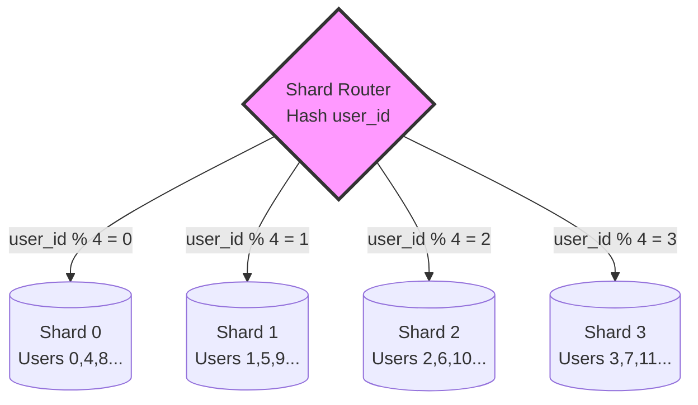
```mermaid
graph TB
    Router{Shard Router<br/>Hash user_id}

    Router -->|user_id % 4 = 0| S0[(Shard 0<br/>Users 0,4,8...)]
    Router -->|user_id % 4 = 1| S1[(Shard 1<br/>Users 1,5,9...)]
    Router -->|user_id % 4 = 2| S2[(Shard 2<br/>Users 2,6,10...)]
    Router -->|user_id % 4 = 3| S3[(Shard 3<br/>Users 3,7,11...)]

    style Router fill:#f9f,stroke:#333,stroke-width:3px
```

### Geographic Sharding

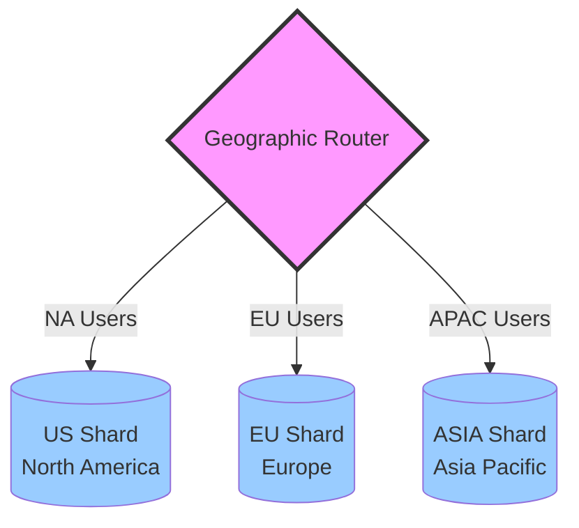
```mermaid
graph TB
    Router{Geographic Router}

    Router -->|NA Users| US[(US Shard<br/>North America)]
    Router -->|EU Users| EU[(EU Shard<br/>Europe)]
    Router -->|APAC Users| ASIA[(ASIA Shard<br/>Asia Pacific)]

    style Router fill:#f9f,stroke:#333,stroke-width:3px
    style US fill:#9cf
    style EU fill:#9cf
    style ASIA fill:#9cf
```

---

## Pattern 6: Microservices Decomposition

### Monolith vs Microservices

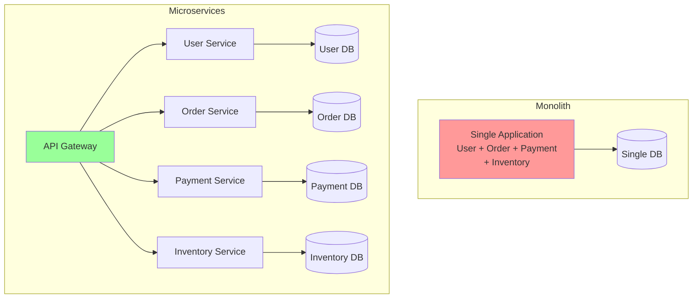
```mermaid
graph TB
    subgraph "Monolith"
        M[Single Application<br/>User + Order + Payment<br/>+ Inventory]
        M --> MDB[(Single DB)]
    end

    subgraph "Microservices"
        GW[API Gateway]
        GW --> US[User Service]
        GW --> OS[Order Service]
        GW --> PS[Payment Service]
        GW --> IS[Inventory Service]

        US --> UD[(User DB)]
        OS --> OD[(Order DB)]
        PS --> PD[(Payment DB)]
        IS --> ID[(Inventory DB)]
    end

    style M fill:#f99
    style GW fill:#9f9
```

**When to Use Microservices:**
- Large team (>50 engineers)
- Independent scaling needs
- Different technology stacks
- Domain complexity

---

## Pattern 7: Event-Driven Architecture

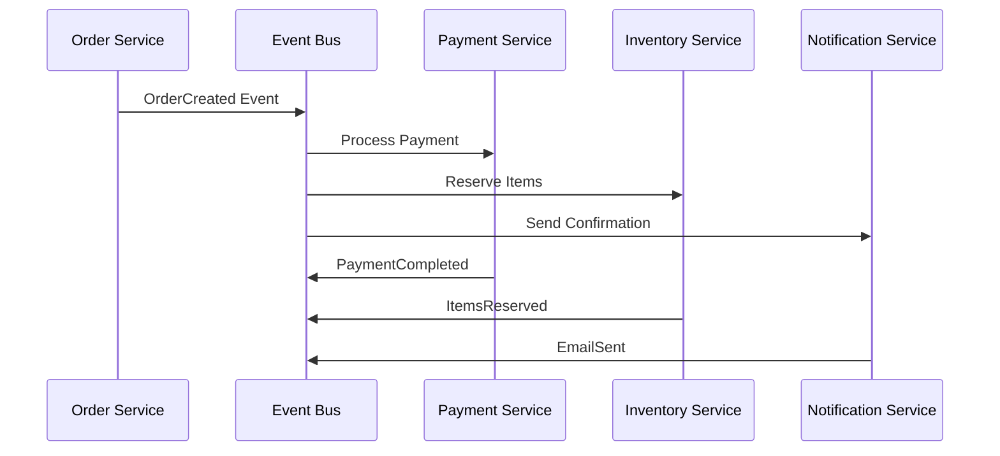
```mermaid
sequenceDiagram
    participant Order Service
    participant Event Bus
    participant Payment Service
    participant Inventory Service
    participant Notification Service

    Order Service->>Event Bus: OrderCreated Event
    Event Bus->>Payment Service: Process Payment
    Event Bus->>Inventory Service: Reserve Items
    Event Bus->>Notification Service: Send Confirmation

    Payment Service->>Event Bus: PaymentCompleted
    Inventory Service->>Event Bus: ItemsReserved
    Notification Service->>Event Bus: EmailSent
```

**Benefits:**
- Loose coupling
- Async processing
- Easy to add new consumers
- Event replay capability

---

## Pattern 8: CQRS (Command Query Responsibility Segregation)

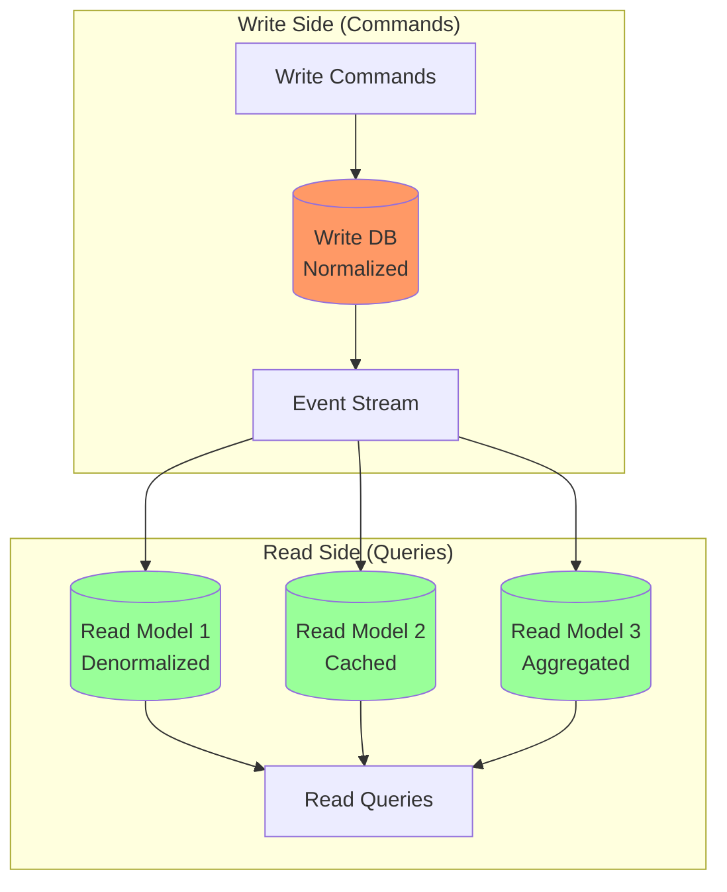
```mermaid
graph TB
    subgraph "Write Side (Commands)"
        WC[Write Commands] --> WDB[(Write DB<br/>Normalized)]
        WDB --> ES[Event Stream]
    end

    subgraph "Read Side (Queries)"
        ES --> R1[(Read Model 1<br/>Denormalized)]
        ES --> R2[(Read Model 2<br/>Cached)]
        ES --> R3[(Read Model 3<br/>Aggregated)]

        R1 --> RQ[Read Queries]
        R2 --> RQ
        R3 --> RQ
    end

    style WDB fill:#f96
    style R1 fill:#9f9
    style R2 fill:#9f9
    style R3 fill:#9f9
```

**Use Cases:**
- Different read/write patterns
- Complex queries needed
- High read throughput
- Reporting requirements

---

## Pattern 9: Circuit Breaker

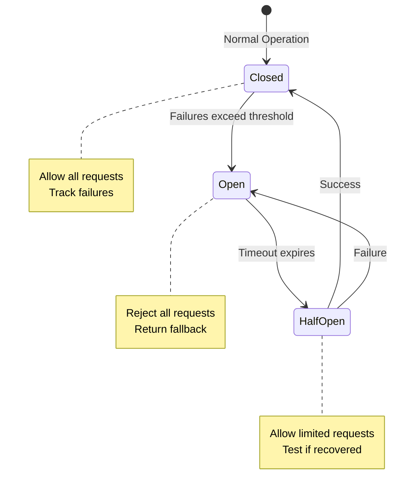
```mermaid
stateDiagram-v2
    [*] --> Closed: Normal Operation

    Closed --> Open: Failures exceed threshold
    Open --> HalfOpen: Timeout expires
    HalfOpen --> Closed: Success
    HalfOpen --> Open: Failure

    note right of Closed
        Allow all requests
        Track failures
    end note

    note right of Open
        Reject all requests
        Return fallback
    end note

    note right of HalfOpen
        Allow limited requests
        Test if recovered
    end note
```

**Example Flow:**

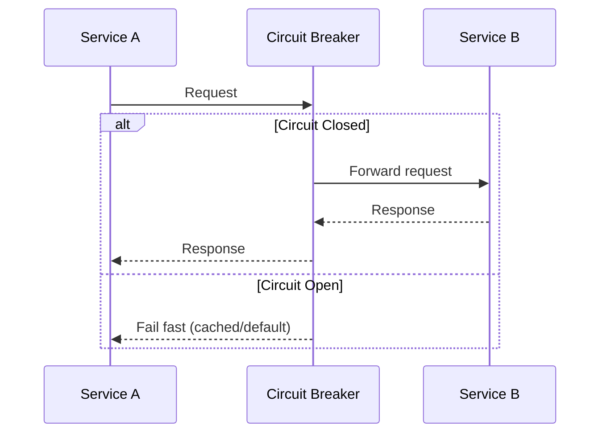
```mermaid
sequenceDiagram
    participant Service A
    participant Circuit Breaker
    participant Service B

    Service A->>Circuit Breaker: Request
    alt Circuit Closed
        Circuit Breaker->>Service B: Forward request
        Service B-->>Circuit Breaker: Response
        Circuit Breaker-->>Service A: Response
    else Circuit Open
        Circuit Breaker-->>Service A: Fail fast (cached/default)
    end
```

---

## Pattern 10: Rate Limiting

### Token Bucket Algorithm

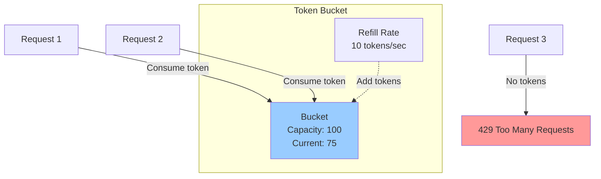
```mermaid
graph TB
    subgraph "Token Bucket"
        Bucket[Bucket<br/>Capacity: 100<br/>Current: 75]
        Refill[Refill Rate<br/>10 tokens/sec]
    end

    Request1[Request 1] -->|Consume token| Bucket
    Request2[Request 2] -->|Consume token| Bucket
    Request3[Request 3] -->|No tokens| Reject[429 Too Many Requests]

    Refill -.->|Add tokens| Bucket

    style Bucket fill:#9cf
    style Reject fill:#f99
```

### Sliding Window

```mermaid
gantt
    title Rate Limit: 100 requests per minute
    dateFormat ss
    axisFormat %S

    section Window 1
    Requests (80) :00, 30s

    section Window 2
    Requests (50) :30, 30s

    section Current
    Allowed? 80*0.5 + 50 = 90 < 100 ✅ :done, 30, 1s
```

---

## Pattern 11: CDN & Edge Computing

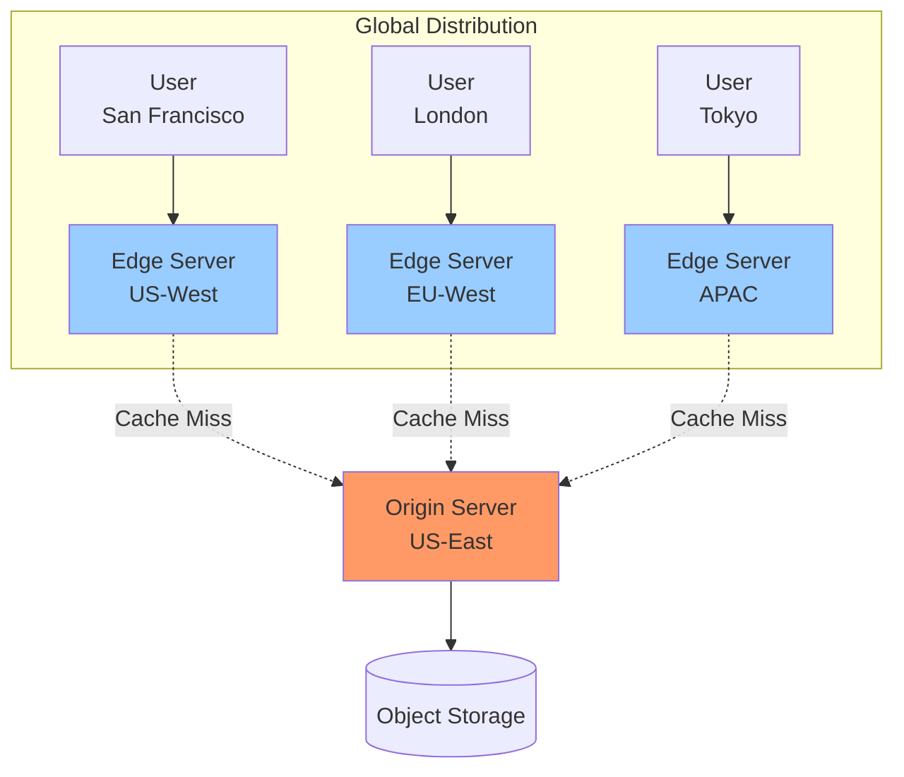
```mermaid
graph TB
    subgraph "Global Distribution"
        User1[User<br/>San Francisco] --> Edge1[Edge Server<br/>US-West]
        User2[User<br/>London] --> Edge2[Edge Server<br/>EU-West]
        User3[User<br/>Tokyo] --> Edge3[Edge Server<br/>APAC]
    end

    Edge1 & Edge2 & Edge3 -.->|Cache Miss| Origin[Origin Server<br/>US-East]

    Origin --> S3[(Object Storage)]

    style Edge1 fill:#9cf
    style Edge2 fill:#9cf
    style Edge3 fill:#9cf
    style Origin fill:#f96
```

**Edge Caching Strategy:**
- Static assets: Cache 30 days
- API responses: Cache 5-60 minutes
- Dynamic content: Cache 0-5 minutes

---

## Pattern 12: Auto-Scaling

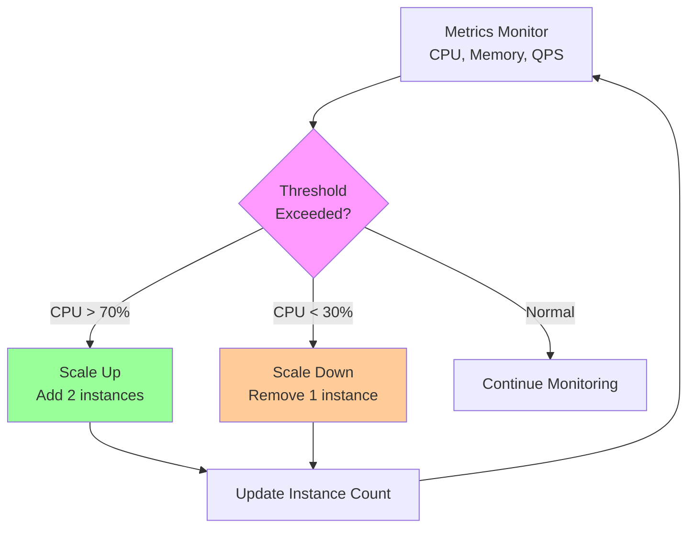
```mermaid
graph TB
    Monitor[Metrics Monitor<br/>CPU, Memory, QPS]

    Monitor --> Decision{Threshold<br/>Exceeded?}

    Decision -->|CPU > 70%| ScaleUp[Scale Up<br/>Add 2 instances]
    Decision -->|CPU < 30%| ScaleDown[Scale Down<br/>Remove 1 instance]
    Decision -->|Normal| Wait[Continue Monitoring]

    ScaleUp --> Instances[Update Instance Count]
    ScaleDown --> Instances
    Instances --> Monitor

    style Decision fill:#f9f
    style ScaleUp fill:#9f9
    style ScaleDown fill:#fc9
```

**Scaling Triggers:**
- CPU utilization > 70%
- Memory usage > 80%
- Request queue length > 100
- Custom metrics (e.g., order rate)

---

## Scaling Comparison Matrix

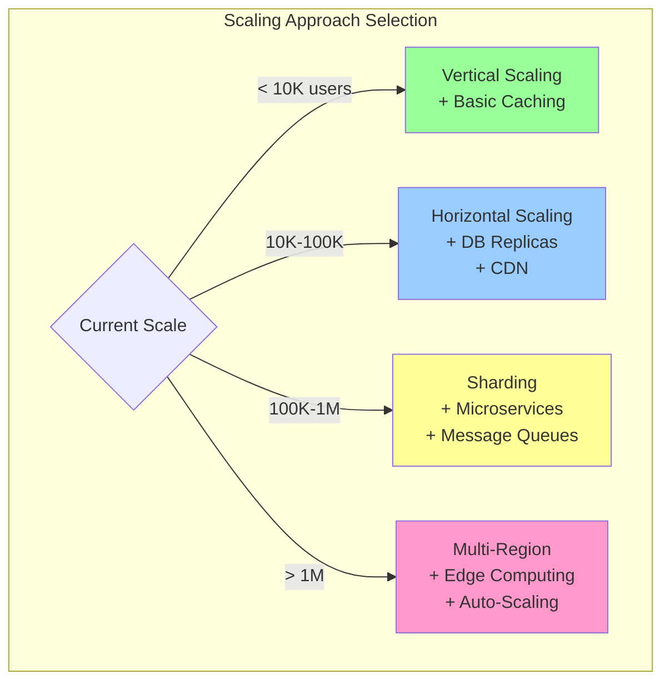
```mermaid
graph TB
    subgraph "Scaling Approach Selection"
        Start{Current Scale}

        Start -->|< 10K users| V[Vertical Scaling<br/>+ Basic Caching]
        Start -->|10K-100K| H[Horizontal Scaling<br/>+ DB Replicas<br/>+ CDN]
        Start -->|100K-1M| S[Sharding<br/>+ Microservices<br/>+ Message Queues]
        Start -->|> 1M| D[Multi-Region<br/>+ Edge Computing<br/>+ Auto-Scaling]
    end

    style V fill:#9f9
    style H fill:#9cf
    style S fill:#ff9
    style D fill:#f9c
```

---

## Real-World Example: Scaling Twitter

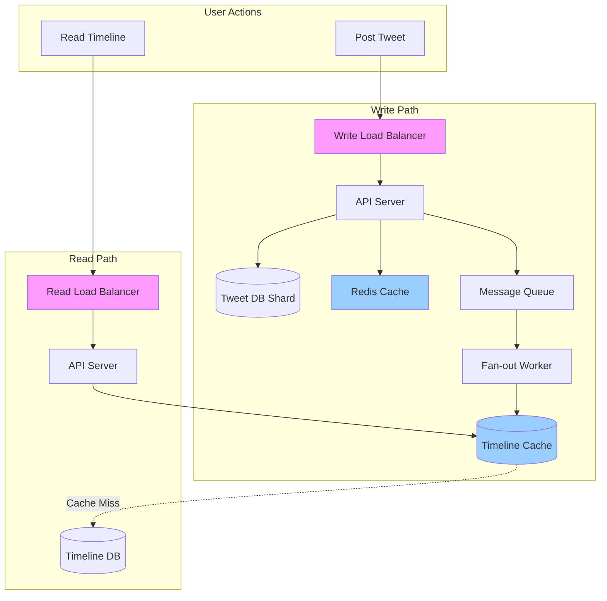
```mermaid
graph TB
    subgraph "User Actions"
        Post[Post Tweet]
        Read[Read Timeline]
    end

    subgraph "Write Path"
        Post --> WLB[Write Load Balancer]
        WLB --> API1[API Server]
        API1 --> WDB[(Tweet DB Shard)]
        API1 --> Cache[Redis Cache]
        API1 --> MQ[Message Queue]
        MQ --> Worker[Fan-out Worker]
        Worker --> Timeline[(Timeline Cache)]
    end

    subgraph "Read Path"
        Read --> RLB[Read Load Balancer]
        RLB --> API2[API Server]
        API2 --> Timeline
        Timeline -.->|Cache Miss| TDB[(Timeline DB)]
    end

    style WLB fill:#f9f
    style RLB fill:#f9f
    style Cache fill:#9cf
    style Timeline fill:#9cf
```

**Key Techniques:**
- Write: Fan-out on write (pre-compute timelines)
- Read: Serve from cache (Redis)
- Sharding: By user_id hash
- Celebrities: Hybrid fan-out (fetch on read)

---

## Key Takeaways

| Pattern | Best For | Scale |
|---------|----------|-------|
| **Vertical Scaling** | Early stage, quick wins | < 10K users |
| **Horizontal Scaling** | Growing traffic | 10K-100K |
| **Caching** | Read-heavy workloads | All scales |
| **Replication** | Read scalability | 100K+ |
| **Sharding** | Write scalability | 1M+ |
| **Microservices** | Large teams, complex domains | 100K+ |
| **Event-Driven** | Async workflows | All scales |
| **CDN** | Global users, static content | All scales |
| **CQRS** | Complex read patterns | 1M+ |
| **Auto-Scaling** | Variable traffic | All scales |

---

[← Back to Topics](index.md) | [Home](../index.md)
